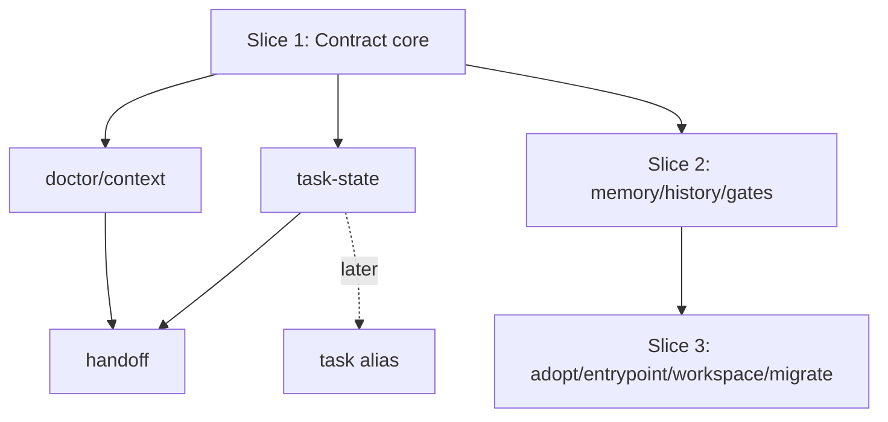

# feat: Anton vNext harness substrate roadmap

## Overview

Anton vNext should become a CLI-first harness substrate for coding agents while
preserving Anton's original repo-agnostic boundary. The vNext product map can
include 11 command families, but implementation must be staged. The first
implementation slice must stabilize the shared contract surface and the existing
task/handoff lifecycle before any broader memory, gates, history, workspace, or
migration commands are built.

This master plan is the top-level execution map. It links to focused subplans
that an implementation agent can pick up without re-reading the full gstack
review bundle.

The confidence lock for this strategy is recorded in
`docs/plans/2026-05-08-010-feat-anton-vnext-confidence-lock-plan.md`. Treat that
file as the merge-blocking checklist for deciding whether the strategy is ready
for implementation.

## Problem Frame

The current v0.0.2 release already provides `doctor`, `task-state`, `handoff`,
`threads`, and `version`. The gstack vNext review expanded the product target to
a larger harness substrate, but follow-up reviews found that the plan was not yet
operationally clear: the repo-agnostic extension rule, the `doctor`/`context`
source of truth, and the 11-command implementation sequence were scattered
across several artifacts instead of being locked in one implementation plan.

## Requirements Trace

- R1. Preserve Anton as a reusable harness CLI, not a wrapper-first product or
  repo-specific runtime adapter.
- R2. Keep one canonical repo contract source, with `doctor` and `context`
  reading the same `ContractV1` builder.
- R3. Treat repo-specific conventions as declared extensions, never hard-coded
  downstream-project branches.
- R4. Stage the 11 command families so Slice 1 can ship without pulling in
  underdefined memory, history, gates, workspace, or migration behavior.
- R5. Convert live-review findings N1 and N2 into first-slice acceptance gates:
  worktree config inheritance and deterministic empty/no-config task bootstrap.
- R6. Keep `codex-threads` as an upstream archive-reader source and
  compatibility surface, while making Anton-native history the product center
  for both conversation archives and project work records.
- R7. Lock Slice 1 acceptance gates before implementation starts, so coding does
  not make product-level decisions implicitly.

## Scope Boundaries

- This plan does not implement code.
- This plan does not change the v0.0.2 release surface by itself.
- Slice 1 must not implement `memory`, native `history`, runnable `gates`,
  `entrypoint sync`, `workspace prepare`, or `migrate apply`.
- Anton vNext must not include a daemon, Kanban board, scheduler, agent runner,
  budget system, multi-tenant service, or product UI.
- Downstream repositories may inspire extension conventions, but Anton core must
  not contain repo-name branches such as `if repo == physedit`.

## Context & Research

### Relevant Code and Patterns

- `internal/app/app.go` is the current command dispatcher and will register any
  new command family.
- `internal/adapter/config.go` owns strict `anton.yaml` v1 parsing and currently
  rejects unsupported versions or unknown fields.
- `internal/adapter/adapter.go` and `internal/adapter/default.go` own repo
  context, task bundle defaults, and path resolution.
- `internal/doctor/doctor.go` currently builds the closest existing execution
  contract through `reportData` and `PromptContract`.
- `internal/taskstate/taskstate.go` owns task lifecycle operations and status
  receipts.
- `internal/handoff/handoff.go` builds handoff packs from task state.
- `internal/*/testdata/golden/*.json` shows the existing golden JSON contract
  pattern that vNext should extend rather than replace.

### Institutional Learnings

- `AGENTS.md` says Anton must stay focused on reusable harness infrastructure,
  prefer one canonical contract plus repo-local `anton.yaml`, and avoid
  downstream business logic.
- `docs/plans/2026-04-16-anton-requirements.md` defines v0 success around
  context resolution, doctor checks, task-state lifecycle, and thin evidence
  integration.
- `docs/handoffs/2026-04-16-anton-handoff.md` explicitly recommends hardening
  canonical contract behavior instead of expanding command surface prematurely.
- `docs/plans/2026-04-17-002-harden-cli-json-exit-contracts.md` established the
  current golden JSON and exit-code discipline.

### External References

- No external research is required for this planning pass. The work is governed
  by local repo contracts, existing Go code, and the already completed gstack
  plan review bundle.

## Key Technical Decisions

- **D1 accepted with conditions:** Anton core stays repo-agnostic. Repo-specific
  behavior must be declared in `extensions.<name>.*`, interpreted only by
  command-level opt-in rules. Before implementing non-core extension behavior,
  each command must state which extension fields it reads and whether it treats
  them as authoritative, advisory, or unsupported.
- **11 command families are a product map, not a first-slice build list:** The
  first implementation slice is limited to `doctor`, `context`, `task-state`,
  `task` alias policy without a runtime alias, and `handoff`.
- **`doctor` and `context` share one builder:** `context` is a presentation
  surface over the same `ContractV1` payload as `doctor`, not a separate resolver.
- **Gates are declarative before runnable:** `gates list/check` can be planned
  later, but no gate runner belongs in Slice 1.
- **History is native receipts before provider bridges:** Anton history should
  own receipts, embedded local archive reading, and bounded project work-record
  reading; `threads` should not define the vNext product model.
- **N2 resolves to a structured friendly error:** Empty/no-config repos without
  a task identity must return a deterministic task-identity-required failure. Do
  not auto-generate task ids in Slice 1.
- **ContractV1 has a minimum field floor:** The implementation may refine field
  names, but it must include literal `schema_version`, adapter, environment, context,
  config, task identity, checks/findings, summary, and prompt-contract data.

## Open Questions

### Resolved During Planning

- Should Anton core absorb PhysEdit-specific fields? No. Use
  `extensions.<name>.*` with command-level opt-in.
- Should all 11 command families be built in the first implementation pass? No.
  Treat them as roadmap phases.
- Should `context` re-resolve repo state independently? No. It must consume the
  shared contract builder used by `doctor`.
- Does the runtime `task` alias ship in Slice 1? No. Slice 1 keeps
  `task-state` canonical and records only the later alias policy.

### Deferred to Implementation

- Exact Go package names and exported method names for `internal/contract`.
- Exact non-minimal `ContractV1` JSON field names after refactoring current
  doctor data.
- Exact release packaging mechanics for prebuilt binaries.

## High-Level Technical Design

> This illustrates the intended approach and is directional guidance for review,
> not implementation specification. The implementing agent should treat it as
> context, not code to reproduce.

The critical invariant is that every later command reads from the same contract
model. New command families are projections over the core, not parallel sources
of repo truth.

## Implementation Units

- [ ] **Unit 1: Lock Slice 1 scope and extension boundary**

**Goal:** Convert the gstack review decision surface into a stable vNext
implementation boundary.

**Requirements:** R1, R3, R4

**Dependencies:** None

**Files:**
- Modify: `docs/plans/2026-05-08-001-feat-anton-vnext-master-roadmap-plan.md`
- Modify: `docs/plans/2026-05-08-002-feat-anton-contract-context-slice-plan.md`
- Modify: `docs/plans/2026-05-08-003-feat-anton-task-handoff-slice-plan.md`
- Modify: `docs/plans/2026-05-08-004-feat-anton-future-surfaces-roadmap-plan.md`
- Test: none

**Approach:**
- Treat D1 as accepted with command-level extension conditions.
- Mark Slice 1 as the only implementation-ready slice.
- Record deferred command families explicitly so future agents do not infer
  permission to build everything at once.

**Patterns to follow:**
- `docs/plans/2026-04-17-002-harden-cli-json-exit-contracts.md`
- `docs/plans/2026-04-17-003-remaining-issues-review-wave.md`

**Test scenarios:**
- Test expectation: none - this is planning and scoping documentation only.

**Verification:**
- A new implementation agent can identify Slice 1 scope, deferred scope, and
  merge-blocking acceptance gates without opening the gstack artifacts.

- [ ] **Unit 2: Execute Slice 1 contract and context work**

**Goal:** Build the shared `ContractV1` core and `context` projection without
forking current `doctor` behavior.

**Requirements:** R2, R5

**Dependencies:** Unit 1

**Files:**
- See: `docs/plans/2026-05-08-002-feat-anton-contract-context-slice-plan.md`

**Approach:**
- Follow the contract/context subplan.
- Start by extracting existing doctor contract data into a shared package.
- Add `context` only after the shared builder exists.

**Patterns to follow:**
- Existing doctor golden JSON tests under `internal/doctor/testdata/golden/`.
- Existing command dispatcher pattern in `internal/app/app.go`.

**Test scenarios:**
- Integration - `doctor` and `context` emit byte-equal `data.contract` for the
  same fixture repo.
- Edge case - linked worktree fixture inherits discoverable main-checkout config
  or warns explicitly when inheritance cannot be proven.
- Error path - invalid `anton.yaml` still produces the same config error through
  both command surfaces.

**Verification:**
- Contract output has one source of truth and existing `doctor` behavior does
  not regress.

- [ ] **Unit 3: Execute Slice 1 task and handoff hardening**

**Goal:** Harden task bootstrap and handoff consumption around the shared
contract while preserving the existing lifecycle model.

**Requirements:** R2, R4, R5

**Dependencies:** Unit 2

**Files:**
- See: `docs/plans/2026-05-08-003-feat-anton-task-handoff-slice-plan.md`

**Approach:**
- Keep `task-state` canonical during Slice 1.
- Do not register `task` as a runtime alias in Slice 1; record the later
  thin-alias policy only.
- Make handoff consume contract/task receipts instead of recomputing divergent
  state.

**Patterns to follow:**
- `internal/taskstate/taskstate.go`
- `internal/handoff/handoff.go`

**Test scenarios:**
- Error path - empty/no-config repo task initialization returns the locked
  `task-identity-required` N2 behavior without writing files.
- Integration - handoff uses the same contract/task values as the underlying
  receipts.
- Containment - `task` is not registered as a Slice 1 command surface.
- Regression - existing task-state golden JSON still matches or changes only
  with intentional fixture updates.

**Verification:**
- Task lifecycle and handoff are stable enough to support later command families.

- [ ] **Unit 4: Preserve future command roadmap without starting it**

**Goal:** Keep the larger Anton vNext surface visible while preventing premature
implementation.

**Requirements:** R4, R6

**Dependencies:** Units 2 and 3

**Files:**
- See: `docs/plans/2026-05-08-004-feat-anton-future-surfaces-roadmap-plan.md`

**Approach:**
- Define future slices for `adopt`, `memory`, `gates`, `history`, `entrypoint`,
  `workspace`, and `migrate`.
- Record non-goals and trust boundaries for each surface.
- Do not add implementation files in Slice 1 for these surfaces.

**Patterns to follow:**
- `internal/threads/threads.go` as a compatibility surface to replace later.
- Existing README planned-later sections for `entrypoint`.

**Test scenarios:**
- Test expectation: none for master-plan unit. Future subplans define test
  scenarios when those slices become active.

**Verification:**
- Roadmap scope is clear, and Slice 1 review can reject patches that implement
  deferred command families.

## System-Wide Impact

- **Interaction graph:** `internal/contract` becomes the central dependency for
  `doctor`, `context`, and later `handoff`.
- **Error propagation:** Contract errors must preserve current config and usage
  error semantics; future commands should not reinterpret the same repo state
  differently.
- **State lifecycle risks:** Task-state remains the only lifecycle owner in
  Slice 1 to avoid split status schemas.
- **API surface parity:** `doctor --json` remains a compatibility contract while
  `context --json` becomes the blessed first-run projection.
- **Integration coverage:** Golden JSON fixtures must prove cross-command
  consistency rather than isolated payload shape.
- **Unchanged invariants:** Anton remains config-driven, repo-agnostic, CLI-first,
  and separate from `codex-threads` internals.

## Risks & Dependencies

| Risk | Mitigation |
|------|------------|
| Implementers treat 11 command families as one build wave | Slice 1 scope is explicit and deferred command families are listed as non-goals. |
| `context` diverges from `doctor` | Shared builder and byte-equal contract tests are merge blockers. |
| Extension namespace becomes another hidden repo adapter | D1 is accepted only with per-command extension read/write rules. |
| Worktree and empty-repo failures remain optional polish | N1 and N2 are hard Slice 1 acceptance gates. |
| Strategy confidence erodes during implementation | Use the 010 confidence lock as the implementation-start and review checklist. |
| Test fixture volume becomes hard to maintain | Slice 1 focuses on reusable fixture helpers before broadening to later command families. |

## Documentation / Operational Notes

- After Slice 1 implementation, update `README.md` to explain whether `context`
  or `doctor` is the preferred first command.
- Keep `AGENTS.md` short. Detailed vNext design should stay in `docs/plans/`.
- When later slices begin, create fresh implementation plans rather than treating
  this master plan as permission to implement every surface.

## Sources & References

- Origin design: [/home/puyuandong/.gstack/projects/Andrew0613-Anton/puyuandong-main-design-20260508-111845.md](/home/puyuandong/.gstack/projects/Andrew0613-Anton/puyuandong-main-design-20260508-111845.md)
- Synthesis report: [/home/puyuandong/.gstack/projects/Andrew0613-Anton/haruki-synthesis-report-20260508.md](/home/puyuandong/.gstack/projects/Andrew0613-Anton/haruki-synthesis-report-20260508.md)
- Command matrix: [/home/puyuandong/.gstack/projects/Andrew0613-Anton/puyuandong-haruki-command-contract-matrix-20260508.md](/home/puyuandong/.gstack/projects/Andrew0613-Anton/puyuandong-haruki-command-contract-matrix-20260508.md)
- Current requirements: [docs/plans/2026-04-16-anton-requirements.md](docs/plans/2026-04-16-anton-requirements.md)
- Current implementation plan: [docs/plans/2026-04-16-anton-implementation-plan.md](docs/plans/2026-04-16-anton-implementation-plan.md)
- Handoff: [docs/handoffs/2026-04-16-anton-handoff.md](docs/handoffs/2026-04-16-anton-handoff.md)
- Confidence lock: [docs/plans/2026-05-08-010-feat-anton-vnext-confidence-lock-plan.md](docs/plans/2026-05-08-010-feat-anton-vnext-confidence-lock-plan.md)
