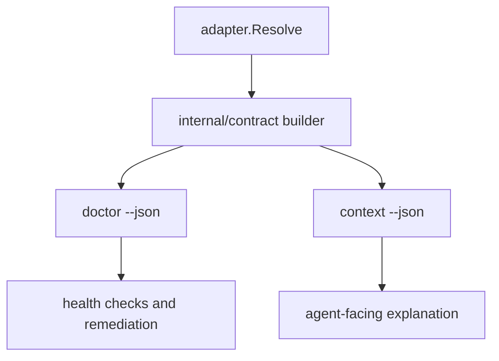

# feat: Anton ContractV1 and context slice

## Overview

Slice 1 starts by extracting a shared `ContractV1` builder from current doctor
behavior, then adding `anton context` as a projection over the same payload.
This is the first implementation-ready vNext subplan because every later command
depends on one stable repo contract.

## Problem Frame

`anton doctor --json` is currently the closest thing to a repo execution
contract, but its contract data lives inside `internal/doctor/doctor.go`.
The vNext plan adds `anton context`, but independent reviews flagged a contract
fork risk if `context` resolves repo state separately. The fix is to introduce
one shared contract builder, move reusable contract data there, and make both
`doctor` and `context` consume it.

## Requirements Trace

- R1. Provide one shared `ContractV1` source used by both `doctor` and `context`.
- R2. Preserve current `doctor --json` compatibility unless a fixture update is
  intentional and review-visible.
- R3. Make `context --json` emit byte-equal `data.contract` to
  `doctor --json` for the same repo state.
- R4. Support worktree config inheritance or explicit warning behavior as a hard
  acceptance gate.
- R5. Keep optional evidence providers non-blocking in first-run context.
- R6. Keep the implementation repo-agnostic and config-driven.

## Scope Boundaries

- Do not build `memory`, `history`, `gates`, `adopt`, `workspace`, `entrypoint`,
  or `migrate` in this slice.
- Do not replace `doctor`; keep it as the environment health surface.
- Do not make `context` a new resolver.
- Do not add repo-specific code branches for PhysEdit, OmniLV, or any other
  downstream repo.

## Context & Research

### Relevant Code and Patterns

- `internal/doctor/doctor.go` contains current `reportData`, `contextContract`,
  `configContract`, check collection, and `renderPromptContract`.
- `internal/adapter/adapter.go` and `internal/adapter/config.go` resolve cwd,
  repo root, worktree kind, and `anton.yaml`.
- `internal/adapter/default.go` resolves entrypoint paths and task bundle roots.
- `internal/app/app.go` dispatches top-level commands.
- `internal/doctor/doctor_test.go` and
  `internal/doctor/testdata/golden/*.json` provide the golden JSON testing
  pattern.

### Institutional Learnings

- The April requirements make `doctor --json` responsible for emitting a
  standard execution contract.
- The April CLI contract hardening plan established golden JSON as the expected
  guard against machine-readable drift.
- The gstack matrix requires `context` and `doctor` to share the same builder and
  preserve byte-equal `data.contract`.

## Key Technical Decisions

- **Introduce `internal/contract`:** This package owns `ContractV1` construction
  from adapter context, config, task identity, entrypoint, and check/warning
  inputs.
- **Keep `doctor` broader than `context`:** `doctor` may include health checks,
  remediation, and summaries around the contract. The shared `data.contract`
  itself must be identical to `context` output.
- **Make `context` first-run friendly:** Human output can be an agent-facing
  explanation of the contract, but the JSON contract is the source of truth.
- **Lock a minimum `ContractV1` field floor:** Slice 1 must expose schema
  version, adapter, environment, context, config, task identity, checks/findings,
  summary, and prompt-contract data. Extra fields may be added only when backed
  by golden fixtures.
- **Treat worktree inheritance as core:** A linked git worktree must inherit the
  main checkout `anton.yaml` when that config is discoverable through git common
  dir metadata. If the main checkout config is missing, ambiguous, or unreadable,
  Anton may use built-in defaults only with an explicit warning and config source.
- **Defer full extension machinery:** Slice 1 can include extension fields in the
  contract model as opaque/advisory metadata, but command-level extension
  interpretation belongs in later slices unless needed for N1.

## Open Questions

### Resolved During Planning

- Is `context` a separate resolver? No. It is a projection over the shared
  contract builder.
- Does `doctor` remain useful? Yes. It remains health-oriented and can include
  checks/remediation around the contract.
- What is the minimum `ContractV1` field floor? Schema version, adapter,
  environment, context, config, task identity, checks/findings, summary, and
  prompt-contract data.
- What is Slice 1 worktree inheritance behavior? Inherit discoverable main
  checkout config by default; warn explicitly when inheritance cannot be proven.

### Deferred to Implementation

- Exact non-minimal `ContractV1` field names after extracting current doctor
  payloads.
- Whether existing `PromptContract` remains a string field in doctor output or is
  replaced by a human-only renderer after `ContractV1` exists.

## High-Level Technical Design

> This illustrates the intended approach and is directional guidance for review,
> not implementation specification. The implementing agent should treat it as
> context, not code to reproduce.

`doctor` and `context` may wrap or render the contract differently, but they must
not build it differently.

## Implementation Units

- [ ] **Unit 1: Extract ContractV1 builder**

**Goal:** Move reusable doctor contract construction into `internal/contract`
without changing behavior unnecessarily.

**Requirements:** R1, R2, R6

**Dependencies:** None

**Files:**
- Create: `internal/contract/contract.go`
- Create: `internal/contract/contract_test.go`
- Modify: `internal/doctor/doctor.go`
- Test: `internal/contract/contract_test.go`
- Test: `internal/doctor/doctor_test.go`

**Approach:**
- Start from the existing doctor data shape rather than designing a fresh schema
  in isolation.
- Define the minimum shared contract fields needed by `doctor`, `context`,
  `task-state`, and `handoff`.
- Include a literal `schema_version` field in the contract payload before adding
  future consumers.
- Keep dynamic host/time/path values normalized in tests the same way existing
  golden helpers do.

**Execution note:** Characterization-first. Preserve existing doctor behavior
before broadening the payload.

**Patterns to follow:**
- `internal/doctor/doctor.go`
- `internal/doctor/doctor_test.go`
- `internal/doctor/testdata/golden/doctor_degraded.json`

**Test scenarios:**
- Happy path - configured repo builds a contract with repo root, worktree kind,
  entrypoint path, task root, and task identity.
- Error path - invalid `anton.yaml` still returns the existing config failure
  through doctor.
- Regression - existing doctor golden JSON changes only where the contract
  extraction intentionally changes the payload.
- Compatibility - `doctor --json` and `context --json` expose byte-equal
  `ContractV1` core data after removing command wrapper fields.

**Verification:**
- Existing doctor tests remain meaningful, and contract construction has direct
  unit coverage independent of command rendering.

- [ ] **Unit 2: Add `anton context` command**

**Goal:** Add the blessed first-run command that presents the shared contract
without adding another resolver.

**Requirements:** R1, R3, R5

**Dependencies:** Unit 1

**Files:**
- Create: `internal/contextcmd/context.go`
- Create: `internal/contextcmd/context_test.go`
- Modify: `internal/app/app.go`
- Modify: `README.md`
- Test: `internal/contextcmd/context_test.go`
- Test: `internal/app/app_test.go`

**Approach:**
- Register `context` as a top-level command.
- For JSON, emit the shared contract under the same `data.contract` object used
  by doctor.
- For human output, present repo, entrypoint, task, warnings, and next action in
  a compact agent-facing form.
- Keep optional evidence status degraded/non-blocking.

**Patterns to follow:**
- Command dispatch in `internal/app/app.go`.
- JSON/human split in `internal/doctor/doctor.go` and
  `internal/taskstate/taskstate.go`.

**Test scenarios:**
- Happy path - `context --json` returns `ok=true` and a `data.contract` object.
- Integration - `context --json` and `doctor --json` produce byte-equal
  `data.contract` for the same fixture repo.
- Error path - unsupported arguments return usage failure consistently with
  other commands.
- Edge case - missing optional evidence provider does not block `context`.

**Verification:**
- A new agent can run `anton context --json` or `anton context --explain` and get
  a complete working contract without consulting `doctor` internals.

- [ ] **Unit 3: Harden worktree config inheritance**

**Goal:** Prevent linked worktrees from silently receiving built-in defaults when
  the parent checkout has the intended `anton.yaml`.

**Requirements:** R4, R6

**Dependencies:** Unit 1

**Files:**
- Modify: `internal/adapter/config.go`
- Modify: `internal/adapter/adapter.go`
- Modify: `internal/adapter/adapter_test.go`
- Add: `internal/adapter/testdata/contexts/worktree-inherited/anton.yaml`
- Test: `internal/adapter/adapter_test.go`
- Test: `internal/doctor/doctor_test.go`
- Test: `internal/contextcmd/context_test.go`

**Approach:**
- Detect linked git worktrees using existing context information plus git common
  dir metadata where needed.
- Load the main checkout config by default when git common dir metadata points to
  a discoverable checkout containing `anton.yaml`.
- Mark the config source explicitly as inherited from the main checkout.
- If the main checkout config is missing, ambiguous, or unreadable, emit an
  explicit warning instead of silently presenting built-in defaults as if they
  were the repo contract.

**Patterns to follow:**
- Existing context fixtures under `internal/adapter/testdata/contexts/`.
- Existing config source reporting in `Config.Source()`.

**Test scenarios:**
- Happy path - linked worktree inherits parent `anton.yaml` and reports the
  inherited config source.
- Edge case - linked worktree with missing, ambiguous, or unreadable main
  checkout config emits a warning and does not claim the parent config as active.
- Regression - normal repo root and plain directory config behavior is unchanged.
- Integration - doctor/context contract fields match for inherited worktree
  config.

**Verification:**
- Worktree agents do not receive a wrong task root silently.

- [ ] **Unit 4: Lock contract compatibility and docs**

**Goal:** Make the first-run contract path explicit in docs and fixtures.

**Requirements:** R2, R3, R5

**Dependencies:** Units 1-3

**Files:**
- Modify: `README.md`
- Modify: `docs/plans/2026-05-08-002-feat-anton-contract-context-slice-plan.md`
- Test: `internal/doctor/doctor_test.go`
- Test: `internal/contextcmd/context_test.go`

**Approach:**
- Document whether users should start with `anton context --explain`,
  `anton context --json`, or `anton doctor --json`.
- Explain that `doctor` and `context` share contract truth.
- Keep detailed design in docs, not `AGENTS.md`.

**Patterns to follow:**
- README current compact CLI reference.
- `AGENTS.md` instruction to keep README and AGENTS short.

**Test scenarios:**
- Test expectation: docs do not need behavioral tests, but command examples must
  match actual command names and payload semantics.

**Verification:**
- Documentation no longer leaves new users choosing between two competing first
  commands.

## System-Wide Impact

- **Interaction graph:** `internal/contract` becomes a dependency of `doctor`,
  `context`, and later `handoff`.
- **Error propagation:** Config and environment errors should surface through the
  same error codes for both `doctor` and `context`.
- **State lifecycle risks:** Contract fields must not mutate task state.
- **API surface parity:** `doctor --json` remains compatible; `context --json`
  becomes the preferred first-run contract projection.
- **Integration coverage:** Byte-equal contract assertions are required because
  package-local tests alone cannot prove cross-command parity.
- **Unchanged invariants:** `codex-threads` remains optional; no repo-specific
  branches are introduced.

## Risks & Dependencies

| Risk | Mitigation |
|------|------------|
| Contract extraction breaks existing doctor consumers | Preserve current doctor fields where possible and update golden fixtures only intentionally. |
| Context grows its own resolver over time | Keep all contract construction in `internal/contract` and test byte equality. |
| Worktree inheritance is guessed incorrectly | Require explicit source labeling and warning behavior. |
| Config v2 work lands before contract is stable | Defer broad v2 module work unless it is necessary for worktree inheritance. |

## Documentation / Operational Notes

- After this slice, `README.md` should name `anton context --explain` as the
  likely first-run human command if that is the final UX choice.
- `doctor --json` should remain valid for automation that already depends on it.
- The 010 confidence lock is a required pre-implementation checklist for this
  slice.

## Sources & References

- Master plan: [docs/plans/2026-05-08-001-feat-anton-vnext-master-roadmap-plan.md](docs/plans/2026-05-08-001-feat-anton-vnext-master-roadmap-plan.md)
- Current doctor: [internal/doctor/doctor.go](internal/doctor/doctor.go)
- Current adapter config: [internal/adapter/config.go](internal/adapter/config.go)
- Command matrix: [/home/puyuandong/.gstack/projects/Andrew0613-Anton/puyuandong-haruki-command-contract-matrix-20260508.md](/home/puyuandong/.gstack/projects/Andrew0613-Anton/puyuandong-haruki-command-contract-matrix-20260508.md)
- Confidence lock: [docs/plans/2026-05-08-010-feat-anton-vnext-confidence-lock-plan.md](docs/plans/2026-05-08-010-feat-anton-vnext-confidence-lock-plan.md)
