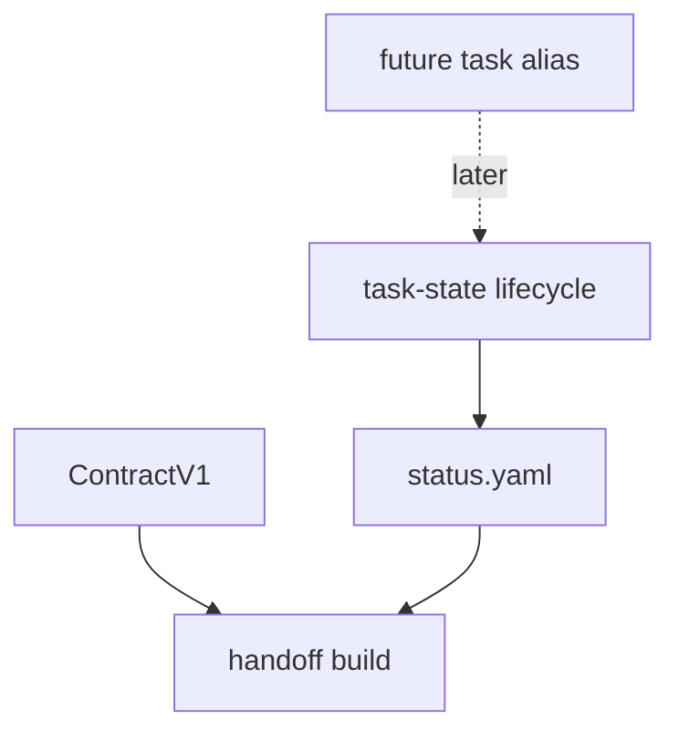

# feat: Anton task and handoff Slice 1 hardening

## Overview

This subplan hardens Anton's existing task lifecycle and handoff behavior after
the shared contract slice is underway. The goal is not to invent another task
model. The goal is to make task bootstrap, `task` alias policy, and handoff
generation consistent with the shared `ContractV1` receipt.

## Problem Frame

Anton already has a useful `task-state` surface, but vNext introduces a preferred
`task` command family and a broader handoff model. Reviews flagged two dangers:
`task` might create a second lifecycle schema, and `handoff` might recompute repo
state differently from `doctor/context`. N2 also showed that new/simple repos
need deterministic task bootstrap behavior instead of an ambiguous inference
failure.

## Requirements Trace

- R1. Preserve `task-state` as the canonical lifecycle implementation during
  Slice 1.
- R2. If `task` is added, make it a thin alias over `task-state`, not another
  state model.
- R3. Resolve N2 with explicit empty/no-config task bootstrap behavior.
- R4. Make `handoff build` consume shared contract and task receipts without
  recomputing divergent state.
- R5. Keep PhysEdit-style nested-topic behavior out of canonical core unless it
  is expressed through generic extension metadata.
- R6. Preserve golden JSON and exit-code discipline for lifecycle commands.

## Scope Boundaries

- Do not add full memory, history, or gates systems in this slice.
- Do not add a separate `status.yaml` schema outside `internal/taskstate`.
- Do not require downstream-specific `handover/` directories as canonical Anton
  core behavior.
- Do not make `task-state` disappear in Slice 1. Backward compatibility matters.

## Context & Research

### Relevant Code and Patterns

- `internal/taskstate/taskstate.go` owns `init`, `pulse`, `check`, `close`,
  `reopen`, `retarget`, and `import`.
- `internal/adapter/default.go` owns current task id inference and canonical
  `.anton/tasks/active/<id_slug>` layout.
- `internal/handoff/handoff.go` reads task bundle files and `status.yaml` to
  build a handoff pack.
- `internal/taskstate/testdata/golden/*.json` locks existing task-state JSON.
- `internal/handoff/handoff_test.go` covers handoff pack behavior.

### Institutional Learnings

- `docs/handoffs/2026-04-16-anton-handoff.md` recommends tightening task schema
  and JSON/human ambiguity before expanding surfaces.
- The gstack matrix says `task` must delegate one-to-one to `task-state`.
- The latest review says N2 is a first-slice hard gate, not optional polish.

## Key Technical Decisions

- **`task-state` stays canonical in Slice 1:** Slice 1 does not add a runtime
  `anton task` alias. It locks the policy that any later alias must delegate to
  `task-state`, keep one status schema, and preserve compatibility labels unless
  a later alias-specific fixture intentionally changes them.
- **N2 is locked to a friendly error:** Empty/no-config repo behavior must be a
  deterministic structured failure that tells the user how to provide task
  identity. Slice 1 must not auto-generate task ids.
- **Handoff consumes receipts:** Handoff should use shared contract/task values
  rather than independently resolving state in a way that can disagree with
  `doctor/context`.
- **Nested topics are extension behavior:** Topic subdirectories are not a
  universal Anton default. They may be supported by generic extension metadata
  later, but Slice 1 should avoid hard-coded downstream layouts.

## Open Questions

### Resolved During Planning

- Should `task` own a new lifecycle? No.
- Does the runtime `task` alias land in Slice 1? No. Slice 1 hardens
  `task-state`; a later thin-alias patch may add `task`.
- Should `handoff` recompute contract truth? No.
- Should empty/no-config behavior remain a vague inference error? No.
- Should N2 auto-generate a task id? No. It returns a structured
  task-identity-required error with remediation.

### Deferred to Implementation

- Exact handoff payload shape after `ContractV1` becomes available.

## High-Level Technical Design

> This illustrates the intended approach and is directional guidance for review,
> not implementation specification. The implementing agent should treat it as
> context, not code to reproduce.

The lifecycle owner is still `task-state`. A future `task` command can only be a
facade, and `handoff` is a consumer of contract plus task receipts.

## Implementation Units

- [ ] **Unit 1: Specify and test N2 task bootstrap behavior**

**Goal:** Make empty/no-config repo task initialization deterministic and
actionable.

**Requirements:** R3, R6

**Dependencies:** Contract/context slice Unit 1 is helpful but not strictly
required if this unit stays in adapter/taskstate tests.

**Files:**
- Modify: `internal/adapter/default.go`
- Modify: `internal/adapter/adapter_test.go`
- Modify: `internal/taskstate/taskstate.go`
- Modify: `internal/taskstate/taskstate_test.go`
- Add: `internal/taskstate/testdata/golden/task_state_init_no_task_id.json`
- Test: `internal/adapter/adapter_test.go`
- Test: `internal/taskstate/taskstate_test.go`

**Approach:**
- Implement N2 as a structured friendly error with machine error code
  `task-identity-required`; the message must mention `ANTON_TASK_ID`, a
  `task/<id_slug>` branch, or running inside an existing task bundle.
- Do not create an implicit fallback id in Slice 1.
- Do not hide missing task identity behind generic runtime failure text.

**Execution note:** Test-first. Add the no-task-id fixture before changing task
bundle inference.

**Patterns to follow:**
- Task id validation in `internal/adapter/task_id.go`.
- Current task-state golden error fixtures.

**Test scenarios:**
- Error path - empty/no-config repo with no task id returns
  `task-identity-required` with remediation text and no files written.
- Happy path - `ANTON_TASK_ID` still creates `.anton/tasks/active/<id_slug>`.
- Edge case - invalid task id still fails validation and cannot escape task root.
- Regression - running inside an existing task bundle still resolves that bundle.

**Verification:**
- N2 is no longer ambiguous, returns the locked friendly error, and is covered by
  a golden JSON fixture.

- [ ] **Unit 2: Lock `task` alias policy without adding the runtime alias**

**Goal:** Remove alias ambiguity without creating another lifecycle in Slice 1.

**Requirements:** R1, R2, R6

**Dependencies:** Unit 1

**Files:**
- Modify: `README.md`
- Modify: `internal/app/app_test.go`
- Test: `internal/app/app_test.go`

**Approach:**
- Do not register a top-level `task` command in Slice 1.
- Document that `task-state` remains the canonical lifecycle command.
- Add or preserve an app-level test showing `task` is not an approved Slice 1
  command surface.
- Record the later alias rule: when `task` lands, it must delegate to
  `task-state` and preserve `task-state` output labels unless a dedicated alias
  plan changes fixtures intentionally.

**Patterns to follow:**
- `internal/app/app.go` top-level dispatch.
- Existing usage text in task-state.

**Test scenarios:**
- Regression - `task-state` commands remain available.
- Error path - `task` is not registered in Slice 1 and returns the standard
  usage failure.
- Future policy - later alias implementation must prove delegation to
  `task-state` with fixtures before becoming available.

**Verification:**
- There is still one lifecycle implementation and one status schema.

- [ ] **Unit 3: Refactor handoff to consume shared contract receipts**

**Goal:** Prevent handoff output from drifting away from `doctor/context` contract
truth.

**Requirements:** R4, R6

**Dependencies:** Contract/context slice Unit 1

**Files:**
- Modify: `internal/handoff/handoff.go`
- Modify: `internal/handoff/handoff_test.go`
- Modify: `internal/contract/contract.go`
- Test: `internal/handoff/handoff_test.go`
- Test: `internal/contract/contract_test.go`

**Approach:**
- Handoff should receive or build the shared contract through `internal/contract`,
  then include selected contract fields in its machine-readable payload.
- Keep task-plan, findings, progress, and status reading in the task/handoff
  boundary.
- Detect and report meaningful drift when the active task path and contract task
  identity disagree.

**Patterns to follow:**
- Existing handoff JSON and human output structure.
- Existing task-state receipt fields in `status.yaml`.

**Test scenarios:**
- Happy path - handoff includes contract-derived repo/task fields and task-state
  evidence.
- Integration - handoff contract fields match `doctor/context` for the same
  fixture repo.
- Error path - missing active task produces an actionable structured failure.
- Edge case - contract task identity and status task identity disagree, producing
  an explicit drift warning or failure according to severity.

**Verification:**
- A handoff pack can be trusted as a compact continuation artifact and does not
  create another repo-state interpretation.

- [ ] **Unit 4: Preserve status schema ownership**

**Goal:** Prevent vNext task, gates, or handoff work from duplicating the
`status.yaml` schema.

**Requirements:** R1, R2, R5

**Dependencies:** Units 1-3

**Files:**
- Modify: `internal/taskstate/taskstate.go`
- Modify: `internal/taskstate/taskstate_test.go`
- Modify: `docs/plans/2026-05-08-003-feat-anton-task-handoff-slice-plan.md`
- Test: `internal/taskstate/taskstate_test.go`

**Approach:**
- Keep status parsing, validation, and lifecycle transition logic in
  `internal/taskstate`.
- If future gates or extension fields are needed, make them additional metadata
  interpreted through task-state-owned validation paths.

**Patterns to follow:**
- Current `internal/adapter/status_yaml.go` validation helpers.
- Existing task-state close and import flows.

**Test scenarios:**
- Regression - existing status fixtures remain valid.
- Error path - malformed status still fails through task-state-owned validation.
- Integration - handoff reads validated status rather than parsing a competing
  schema.

**Verification:**
- Reviewers can confirm there is no second status schema for `task` or `handoff`.

## System-Wide Impact

- **Interaction graph:** `task-state` remains the lifecycle source; `task` and
  `handoff` are consumers or facades.
- **Error propagation:** Task bootstrap failures should include clear cause and
  next action, not just generic inference failure.
- **State lifecycle risks:** Duplicated schema or alias-owned state would split
  closure truth; this plan blocks that.
- **API surface parity:** Backward-compatible `task-state` remains available
  while any new `task` facade is introduced carefully.
- **Integration coverage:** Handoff must be tested against the same contract/task
  values as doctor/context.
- **Unchanged invariants:** Canonical Anton layout remains `.anton/tasks` unless
  config or future extension metadata declares otherwise.

## Risks & Dependencies

| Risk | Mitigation |
|------|------------|
| `task` becomes a second lifecycle command | Route it through task-state or defer it. |
| N2 choice is made implicitly during coding | Lock N2 to `task-identity-required` and require a golden no-write fixture. |
| Handoff recomputes state differently from contract | Consume `internal/contract` and add drift tests. |
| Downstream handover conventions leak into core | Keep `handover/` and `end_state_verified` as extension or future-schema concerns. |

## Documentation / Operational Notes

- README should say whether `task` is preferred or whether `task-state` remains
  canonical for vNext Slice 1.
- Docs should show the required task identity sources for the N2 friendly error.
- Docs should explicitly state that Slice 1 does not auto-create task ids when no
  identity signal exists.

## Sources & References

- Master plan: [docs/plans/2026-05-08-001-feat-anton-vnext-master-roadmap-plan.md](docs/plans/2026-05-08-001-feat-anton-vnext-master-roadmap-plan.md)
- Current task-state: [internal/taskstate/taskstate.go](internal/taskstate/taskstate.go)
- Current task bundle resolution: [internal/adapter/default.go](internal/adapter/default.go)
- Current handoff: [internal/handoff/handoff.go](internal/handoff/handoff.go)
- Command matrix: [/home/puyuandong/.gstack/projects/Andrew0613-Anton/puyuandong-haruki-command-contract-matrix-20260508.md](/home/puyuandong/.gstack/projects/Andrew0613-Anton/puyuandong-haruki-command-contract-matrix-20260508.md)
- Confidence lock: [docs/plans/2026-05-08-010-feat-anton-vnext-confidence-lock-plan.md](docs/plans/2026-05-08-010-feat-anton-vnext-confidence-lock-plan.md)
