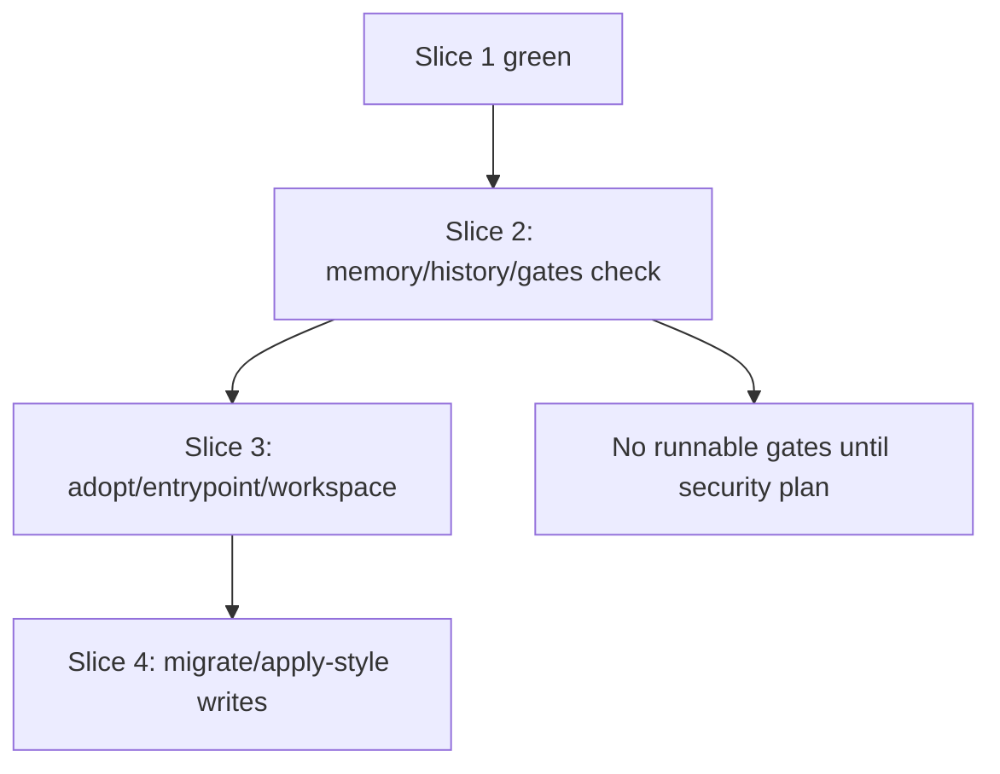

# feat: Anton future native surfaces roadmap

## Overview

This subplan records the future Anton vNext command families that should not be
implemented in Slice 1. It keeps the all-in harness substrate direction visible
while preventing premature work on under-specified surfaces.

This file is now the index for the future-surface plan family. Detailed child
plans live at:

- `docs/plans/2026-05-08-005-feat-anton-adopt-plan-surface-plan.md`
- `docs/plans/2026-05-08-006-feat-anton-memory-surface-plan.md`
- `docs/plans/2026-05-08-007-feat-anton-history-evidence-surface-plan.md`
- `docs/plans/2026-05-08-008-feat-anton-declarative-gates-surface-plan.md`
- `docs/plans/2026-05-08-009-feat-anton-maintenance-surfaces-plan.md`

These child plans have now been promoted from roadmap sketches to
command-specific implementation plans. They become eligible only after the
confidence lock in
`docs/plans/2026-05-08-010-feat-anton-vnext-confidence-lock-plan.md` is green and
the Slice 1 contract/task gates have landed.

## Child Plan Graduation Status

| Child plan | Status | Still blocked |
|------------|--------|---------------|
| `005` adopt plan | Implementation-ready after Slice 1 | `adopt apply` |
| `006` memory | Implementation-ready after Slice 1 | authority promotion, pruning |
| `007` history | Implementation-ready after Slice 1 as embedded archive and project working-memory reader | extra providers, `threads` deprecation |
| `008` gates | Implementation-ready after Slice 1 | `gates run` |
| `009` maintenance | `entrypoint check` and `workspace inspect/check` implementation-ready after Slice 1; `migrate plan` waits for v2 schema lock | `entrypoint sync`, `workspace prepare`, `migrate apply` |

## Problem Frame

The vNext gstack design names 11 native command families. That product map is
useful, but independent reviews agreed that implementation must start with the
shared contract, context, task lifecycle, and handoff. Future surfaces need trust
boundaries, extension rules, and test strategy before they become implementation
work.

## Requirements Trace

- R1. Preserve the long-term Anton harness substrate direction.
- R2. Defer future command implementation until Slice 1 gates are green.
- R3. Keep memory, history, and gates non-authoritative or declarative until
  their trust models are explicit.
- R4. Absorb the useful `codex-threads` local archive-reader behavior and
  project working-memory records into Anton-native history so users do not need
  a separate binary, while avoiding a wrapper-first command center.
- R5. Keep migration and workspace features local, bounded, and safe.

## Scope Boundaries

- This index plan is not itself an implementation patch plan; use the child plan
  for the specific command family.
- Do not build any future command until its child plan and the 010 confidence
  lock both allow it.
- Do not implement runnable gate execution in the same slice as declarative gate
  listing/checking.
- Do not implement automatic repo patching as part of `adopt plan`.
- Do not implement hosted policy, scheduler, agent runner, queue, or UI features.
- Do not start any future surface until its child plan has a command-specific
  authority matrix, golden JSON fixture list, and safety gate.

## Context & Research

### Relevant Code and Patterns

- `internal/threads/threads.go` is the existing external compatibility wrapper
  that future native history must not simply rename.
- `internal/taskstate/taskstate.go` already records evidence and lifecycle
  receipts that future memory/history/handoff work should respect.
- `internal/app/app.go` centralizes command registration, so future command work
  must be sequenced to avoid dispatcher churn.
- Existing golden JSON tests show how future command contracts should be pinned.

### Institutional Learnings

- `AGENTS.md` treats `codex-threads` as an upstream source surface whose archive
  behavior may be absorbed with attribution.
- The April implementation plan explicitly warned against broad plugin or daemon
  ecosystems before core CLI surfaces were stable.
- The latest gstack matrix marks full extension scope, runtime contracts,
  distribution matrix, and concrete history provider list as deferred.

## Key Technical Decisions

- **Adopt remains read-only first:** `anton adopt plan` may report gaps, but
  `adopt apply` belongs to a later safety-reviewed slice.
- **Memory is advisory by default:** Memory cannot override `AGENTS.md`, repo
  config, or contract-authoritative fields.
- **Gates are declarative before execution:** `gates list/check` can precede
  `gates run`; `gates run` requires a separate security plan.
- **History is Anton-native receipts plus embedded archive and work-record
  reading:** Anton owns receipts, local archive reading, and bounded project
  working-memory ingestion; core history must not require installing
  `codex-threads`.
- **Entrypoint sync is later than entrypoint check:** Checking docs against the
  contract is lower risk than rewriting entrypoints.
- **Workspace operations must defend path boundaries:** Workspace inspect/prepare
  must guard against prefix collisions, traversal, and symlink escape.
- **Migrate is versioned and reversible:** `migrate plan` comes before `migrate
  apply`, but `migrate plan` waits for a locked v2 config schema; apply must
  snapshot old config before writing.

## Open Questions

### Resolved During Planning

- Should future command surfaces be deleted from the roadmap? No. Keep them as
  future slices.
- Should `threads` stay as the product model? No. It becomes compatibility after
  native history exists.
- Should memory become authoritative by default? No.

### Deferred Beyond Current Child Plans

- Memory authority promotion model beyond advisory records.
- Additional history providers beyond first-slice embedded local Codex archive
  reading and declared project working-memory roots.
- `threads` deprecation timing after native history parity.
- `.anton/gates/*.yaml` declaration source and `gates run` security model.
- Dedicated workspace schema beyond first-slice `threads.workspace_roots`.
- Mutating maintenance behavior for `entrypoint sync`, `workspace prepare`, and
  `migrate apply`.

## High-Level Technical Design

> This illustrates the intended approach and is directional guidance for review,
> not implementation specification. The implementing agent should treat it as
> context, not code to reproduce.

Future commands should land only after their trust, safety, and contract
semantics are explicit.

## Implementation Units

- [ ] **Unit 1: Plan `adopt plan` as a read-only gap report**

**Goal:** Define repo harness adoption analysis without writing files.

**Requirements:** R1, R2

**Dependencies:** Slice 1 contract builder

**Files:**
- Future create: `internal/adopt/*`
- Future test: `internal/adopt/*_test.go`
- Modify: `internal/app/app.go`
- Modify: `README.md`

**Approach:**
- Read `ContractV1`, entrypoint, task root, and declared conventional paths.
- Produce advisory gaps with source, freshness, confidence, and remediation.
- Avoid full repo scans.

**Patterns to follow:**
- Shared contract builder from Slice 1.
- Golden JSON helpers in existing packages.

**Test scenarios:**
- Happy path - mature repo returns no or low-severity gaps.
- Edge case - no-config repo reports missing adoption pieces without failing.
- Error path - unsupported module is a warning or config error according to
  contract severity.

**Verification:**
- Adoption analysis is useful without mutating the repo.

- [ ] **Unit 2: Plan advisory memory**

**Goal:** Give agents a place to store working memory without letting stale or
  unverified memory override repo truth.

**Requirements:** R3

**Dependencies:** Slice 1 contract builder

**Files:**
- Future create: `internal/memory/*`
- Future test: `internal/memory/*_test.go`
- Modify: `internal/app/app.go`
- Modify: `README.md`

**Approach:**
- Store append-only memory entries with source, freshness, and confidence.
- Treat missing memory as non-blocking.
- Prefer `AGENTS.md`, `anton.yaml`, and contract-authoritative facts when memory
  conflicts with repo truth.

**Patterns to follow:**
- Evidence receipt shape in task-state.
- Trust metadata in the command matrix.

**Test scenarios:**
- Happy path - fresh advisory memory appears in contract warnings or memory
  output.
- Edge case - stale memory is downgraded or warned.
- Error path - memory conflicting with `AGENTS.md` does not override entrypoint
  instructions.

**Verification:**
- Memory helps handoff without becoming hidden policy.

- [ ] **Unit 3: Plan native history receipts, project records, and threads compatibility**

**Goal:** Replace wrapper-first `threads` positioning with Anton-native evidence
receipts, embedded local Codex archive reading, and bounded project
working-memory ingestion.

**Requirements:** R3, R4

**Dependencies:** Slice 1 contract builder and stable task receipts

**Files:**
- Future create: `internal/history/*`
- Future modify: `internal/threads/threads.go`
- Future test: `internal/history/*_test.go`
- Future test: `internal/threads/threads_test.go`

**Approach:**
- Store native append-only evidence receipts.
- Absorb the local Codex session archive reader behavior into Anton's format with
  bounded scan and output controls.
- Read canonical Anton task bundles, Anton memory logs, and declared repo-local
  work-record roots without hard-coding downstream project paths.
- Keep `threads` as a deprecated compatibility alias only after native history
  exists.

**Patterns to follow:**
- Current fake binary tests in `internal/threads/threads_test.go`.
- Task-state evidence receipts.

**Test scenarios:**
- Happy path - native receipt appears in history output.
- Happy path - declared project work records appear in history output.
- Error path - missing session root, malformed session, or oversized payload does
  not block core context.
- Error path - missing declared work root, malformed task status, or symlink
  escape produces warnings without corrupting receipts.
- Integration - `threads` compatibility emits deprecation warning after history
  exists.

**Verification:**
- Anton can own evidence from both conversation history and project work records
  without requiring a separate `codex-threads` install.

- [ ] **Unit 4: Plan declarative gates**

**Goal:** Let repos declare validation and closeout gates without executing
  arbitrary commands in the first gates slice.

**Requirements:** R3, R5

**Dependencies:** Slice 1 contract builder and task lifecycle receipts

**Files:**
- Future create: `internal/gates/*`
- Future test: `internal/gates/*_test.go`
- Modify: `internal/app/app.go`
- Modify: `README.md`

**Approach:**
- Start with `gates list/check`.
- Treat incomplete gate declarations as warnings unless a gate is explicitly
  required for a lifecycle transition.
- Defer `gates run` until a security-focused implementation plan exists.

**Patterns to follow:**
- Safety refusal and exit-code concepts from the command matrix.

**Test scenarios:**
- Happy path - declared gate is listed with required fields.
- Edge case - incomplete gate declaration produces actionable warning.
- Error path - shell-like command content is not executed in declarative check.

**Verification:**
- Gates become visible without becoming unsafe command execution.

- [ ] **Unit 5: Plan entrypoint, workspace, and migration surfaces**

**Goal:** Define later repo-maintenance surfaces after contract and safety
  foundations are stable.

**Requirements:** R1, R2, R5

**Dependencies:** Slice 1 and at least one Slice 2 trust surface

**Files:**
- Future create: `internal/entrypoint/*`
- Future create: `internal/workspace/*`
- Future create: `internal/migrate/*`
- Future test: corresponding `*_test.go` files
- Modify: `internal/app/app.go`
- Modify: `README.md`

**Approach:**
- `entrypoint check` should precede `entrypoint sync`.
- `workspace inspect` should precede `workspace prepare`.
- `migrate plan` and dry-run validators should precede `migrate apply`, but
  `migrate plan` itself must wait until the v2 config shape is locked.
- All path writes need traversal and symlink safety checks.

**Patterns to follow:**
- Strict `anton.yaml` validation in `internal/adapter/config.go`.
- Existing path validation and task id validation helpers.

**Test scenarios:**
- Happy path - entrypoint check reports budget and missing references.
- Edge case - workspace prefix collision does not match the wrong workspace.
- Error path - path traversal or symlink escape is refused.
- Integration - migrate plan preserves v1 fields and reports proposed changes
  before writing, after the v2 schema lock exists.

**Verification:**
- Later maintenance commands are safe enough to expose to agents and humans.

## System-Wide Impact

- **Interaction graph:** Future surfaces depend on Slice 1 contract truth and
  should not bypass it.
- **Error propagation:** Future commands need the same envelope, exit-code, and
  warning semantics as Slice 1.
- **State lifecycle risks:** Memory/history/gates can influence handoff and close
  decisions only through explicit trust levels.
- **API surface parity:** Existing `threads` commands stay compatible until
  native history is ready.
- **Integration coverage:** Each future command family needs contract fixture
  coverage before becoming part of the documented CLI.
- **Unchanged invariants:** No future surface should add repo-specific runtime
  adapters or daemon-only behavior.

## Risks & Dependencies

| Risk | Mitigation |
|------|------------|
| Future roadmap tempts agents to overbuild Slice 1 | Mark all future command files as non-goals until separate implementation plans exist. |
| Memory becomes hidden authority | Require source/freshness/confidence and conflict handling. |
| Gates become unsafe command execution | Start declarative-only and require a separate security plan for run. |
| History becomes renamed threads wrapper | Build native receipts, embedded archive reading, and project working-memory ingestion inside Anton. |
| History ignores actual project work records | Treat canonical task bundles, Anton memory logs, and declared work-record roots as first-slice history sources. |
| Workspace/migration writes become destructive | Require inspect/plan/dry-run surfaces before write-capable commands. |
| Child plans are mistaken for blanket implementation approval | Gate each command on the 010 confidence lock and the specific child-plan allowed surface. |

## Documentation / Operational Notes

- Future command docs should be added only as commands become real.
- README should keep a "current surface" and "planned later surfaces" distinction.
- Any future command that writes files needs idempotency and rollback notes in its
  own plan.

## Sources & References

- Master plan: [docs/plans/2026-05-08-001-feat-anton-vnext-master-roadmap-plan.md](docs/plans/2026-05-08-001-feat-anton-vnext-master-roadmap-plan.md)
- Adopt subplan: [docs/plans/2026-05-08-005-feat-anton-adopt-plan-surface-plan.md](2026-05-08-005-feat-anton-adopt-plan-surface-plan.md)
- Memory subplan: [docs/plans/2026-05-08-006-feat-anton-memory-surface-plan.md](2026-05-08-006-feat-anton-memory-surface-plan.md)
- History subplan: [docs/plans/2026-05-08-007-feat-anton-history-evidence-surface-plan.md](2026-05-08-007-feat-anton-history-evidence-surface-plan.md)
- Gates subplan: [docs/plans/2026-05-08-008-feat-anton-declarative-gates-surface-plan.md](2026-05-08-008-feat-anton-declarative-gates-surface-plan.md)
- Maintenance surfaces subplan: [docs/plans/2026-05-08-009-feat-anton-maintenance-surfaces-plan.md](2026-05-08-009-feat-anton-maintenance-surfaces-plan.md)
- Current threads compatibility surface: [internal/threads/threads.go](internal/threads/threads.go)
- Current app dispatcher: [internal/app/app.go](internal/app/app.go)
- Command matrix: [/home/puyuandong/.gstack/projects/Andrew0613-Anton/puyuandong-haruki-command-contract-matrix-20260508.md](/home/puyuandong/.gstack/projects/Andrew0613-Anton/puyuandong-haruki-command-contract-matrix-20260508.md)
- Confidence lock: [docs/plans/2026-05-08-010-feat-anton-vnext-confidence-lock-plan.md](2026-05-08-010-feat-anton-vnext-confidence-lock-plan.md)
