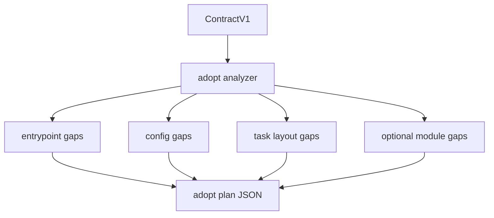

# feat: Anton adopt plan surface

## Overview

`anton adopt plan` should be the read-only adoption advisor for a repo. It
answers: "what harness pieces does this repo already satisfy, what is missing,
and what should a human or agent do next?" It must not edit files in its first
slice.

This plan now satisfies the future-surface graduation gates from
`docs/plans/2026-05-08-010-feat-anton-vnext-confidence-lock-plan.md`: it has a
command-specific authority matrix, read/write boundary, fixture list, failure
policy, and documentation targets.

## Problem Frame

Anton v0 already expects repos to adapt through `anton.yaml`, `.anton/tasks`, and
entrypoint docs. A new repo or partially adopted repo currently has to discover
those requirements by reading README and plans manually. `adopt plan` turns that
knowledge into a machine-readable gap report grounded in `ContractV1`.

## Requirements Trace

- R1. Read the shared `ContractV1` rather than re-resolving repo truth.
- R2. Report adoption gaps for entrypoint, config, task layout, contract health,
  optional evidence providers, and future modules.
- R3. Keep all output advisory unless a config parse failure prevents meaningful
  analysis.
- R4. Avoid broad repo scans. Only inspect declared paths and bounded conventional
  paths.
- R5. Preserve Anton's repo-agnostic boundary. Repo-specific conventions must
  appear through `extensions.<name>.*` metadata.

## Scope Boundaries

- No `adopt apply` in this plan.
- No automatic creation of `AGENTS.md`, `anton.yaml`, `.anton/`, or task bundles.
- No full repository lint, policy audit, or external package analysis.
- No provider calls that can hang the adoption command.

## Context & Research

### Relevant Code and Patterns

- Future dependency: `internal/contract/*` from the Slice 1 contract plan.
- Current config parsing: `internal/adapter/config.go`.
- Current entrypoint resolution: `internal/adapter/default.go`.
- Current command dispatch: `internal/app/app.go`.
- Existing golden JSON style: `internal/doctor/testdata/golden/*.json`.

### Institutional Learnings

- `AGENTS.md` says Anton should keep one canonical contract plus repo-local
  `anton.yaml`.
- `README.md` states unknown `anton.yaml` fields are rejected to make drift
  explicit.
- The gstack matrix says `adopt plan` is pure read and should not perform full
  tree scans.

## Key Technical Decisions

- **Read-only first:** `adopt plan` produces gaps, remediation text, and source
  attribution, but writes nothing.
- **Gap severity is not command success:** A repo with many adoption gaps can
  still return `ok=true` if Anton successfully inspected it.
- **Contract-led analysis:** The command reads `ContractV1`, then checks only
  the files and paths that contract declares.
- **Extension-aware but generic:** Extension namespaces can shape gap analysis
  only through documented per-field rules, not repo names.
- **Fixed severity vocabulary:** Gap severity is one of `info`, `warning`, or
  `blocked`. `blocked` means Anton cannot reliably analyze adoption, not that the
  repo must be modified by this command.
- **Migration belongs elsewhere:** `adopt plan --from v1 --to v2` is not part of
  this command. Config/layout migration belongs to `migrate plan`.

## Open Questions

### Resolved During Planning

- Should `adopt plan` patch files? No.
- Should missing optional modules make `ok=false`? No. They are advisory gaps.
- Should adoption planning own config migration? No. It may point to
  `migrate plan`, but it does not preview schema rewrites.
- What severity names are supported? `info`, `warning`, and `blocked`.

### Deferred to Implementation

- Exact wording of human remediation messages.
- Exact non-core extension metadata fields, if a later slice adds them. The
  first adoption slice treats extensions as opaque/advisory.

## Command Authority Matrix

| Command | Reads core contract | Reads extensions | Writes state | External execution | Authority |
|---------|---------------------|------------------|--------------|--------------------|-----------|
| `adopt plan` | Yes | Opaque/advisory only | No | No | Advisory gap report |

## Failure and Exit Policy

- `adopt plan --json` returns `ok=true` and exit `0` when analysis succeeds,
  even if advisory gaps are present.
- Usage errors return exit `2` with the shared command error envelope.
- Invalid `anton.yaml` or unreadable contract input returns exit `1` with a
  structured config/contract error.
- Missing optional modules, missing explicit config, and missing task root are
  advisory gaps, not command failures.

## Golden Fixture List

- `internal/adopt/testdata/golden/adopt_plan_clean.json`
- `internal/adopt/testdata/golden/adopt_plan_missing_config.json`
- `internal/adopt/testdata/golden/adopt_plan_missing_entrypoint.json`
- `internal/adopt/testdata/golden/adopt_plan_invalid_config.json`
- `internal/adopt/testdata/golden/adopt_plan_usage_error.json`

## Start Gate

`adopt plan` may start after Slice 1 lands `ContractV1`, `doctor/context`
parity, and N2 task bootstrap behavior. It must not land in the same patch as
`adopt apply` or any write-capable adoption workflow.

## High-Level Technical Design

> This illustrates the intended approach and is directional guidance for review,
> not implementation specification. The implementing agent should treat it as
> context, not code to reproduce.

## Implementation Units

- [ ] **Unit 1: Define adoption gap model**

**Goal:** Create the data model for gap findings, severity, source, confidence,
and remediation.

**Requirements:** R1, R2, R3

**Dependencies:** Slice 1 `internal/contract`.

**Files:**
- Create: `internal/adopt/adopt.go`
- Create: `internal/adopt/adopt_test.go`
- Test: `internal/adopt/adopt_test.go`

**Approach:**
- Model each gap as a structured finding with `module`, `severity`, `source`,
  `confidence`, and `remediation`.
- Keep advisory gaps separate from hard command errors.
- Avoid embedding repo-specific gap types.

**Patterns to follow:**
- Existing JSON envelope discipline in `internal/doctor/doctor.go`.
- Contract warning metadata from the command matrix.

**Test scenarios:**
- Happy path - mature repo produces an empty or informational gap list.
- Edge case - no `anton.yaml` produces an advisory config gap with built-in
  defaults as the current source.
- Error path - invalid config prevents reliable analysis and returns config
  failure through the shared command envelope.

**Verification:**
- Gap payloads are stable enough to use in docs, issues, and future migration
  planning.

- [ ] **Unit 2: Implement bounded repo adoption checks**

**Goal:** Inspect only contract-declared and conventional harness files.

**Requirements:** R2, R4

**Dependencies:** Unit 1

**Files:**
- Modify: `internal/adopt/adopt.go`
- Modify: `internal/adopt/adopt_test.go`
- Add: `internal/adopt/testdata/golden/adopt_plan_clean.json`
- Add: `internal/adopt/testdata/golden/adopt_plan_missing_config.json`
- Add: `internal/adopt/testdata/golden/adopt_plan_missing_entrypoint.json`
- Add: `internal/adopt/testdata/golden/adopt_plan_invalid_config.json`
- Test: `internal/adopt/adopt_test.go`

**Approach:**
- Check configured entrypoint existence and budget metadata when available.
- Check config source, task root existence, and task bundle conventions.
- Check optional module declarations only when they appear in contract/config.
- Avoid recursive searches outside declared roots.

**Patterns to follow:**
- `internal/doctor` check and remediation style.
- Adapter path resolution helpers.

**Test scenarios:**
- Happy path - configured repo with entrypoint and task root has no required
  remediation.
- Edge case - repo with built-in defaults reports what would be needed to become
  explicitly adopted.
- Error path - declared path outside repo root is rejected or warned according
  to config severity.
- Integration - adoption analysis reads the same repo root and config source as
  `doctor/context`.

**Verification:**
- The command gives useful adoption guidance without paying full-repo scan cost.

- [ ] **Unit 3: Add CLI surface and docs**

**Goal:** Expose `anton adopt plan` with stable JSON and concise human output.

**Requirements:** R1, R3, R5

**Dependencies:** Units 1 and 2

**Files:**
- Modify: `internal/app/app.go`
- Modify: `internal/app/app_test.go`
- Modify: `README.md`
- Add: `internal/adopt/testdata/golden/adopt_plan_usage_error.json`
- Test: `internal/app/app_test.go`
- Test: `internal/adopt/adopt_test.go`

**Approach:**
- Register `adopt plan` as the only supported subcommand in the first slice.
- Human output should be a short gap list with next actions.
- JSON output should use the shared command envelope.

**Patterns to follow:**
- Current `handoff build` subcommand parsing.
- Current README command reference shape.

**Test scenarios:**
- Happy path - `adopt plan --json` emits `ok=true` and structured gaps.
- Error path - unsupported subcommand returns usage failure.
- Regression - existing command dispatch remains unchanged.

**Verification:**
- New users can run one command to see adoption gaps without changing the repo.

## System-Wide Impact

- **Interaction graph:** `adopt plan` consumes `ContractV1` and declared paths.
- **Error propagation:** Missing harness pieces are warnings/gaps, not failures.
- **State lifecycle risks:** No state is written in this slice.
- **API surface parity:** Future `migrate plan` can reuse adoption gaps, but
  `adopt` does not own migration writes.
- **Integration coverage:** Golden fixtures should cover clean, missing-config,
  and usage-error cases.
- **Unchanged invariants:** Anton stays repo-agnostic and config-driven.

## Risks & Dependencies

| Risk | Mitigation |
|------|------------|
| Gap report becomes a broad repo audit | Bound checks to contract-declared and conventional harness paths. |
| Users expect `adopt plan` to fix files | Keep name and docs explicitly read-only. |
| Repo-specific conventions leak into core | Use extension metadata, not repo-name conditionals. |
| Missing optional features look like failures | Separate advisory gaps from hard command errors. |

## Documentation / Operational Notes

- README should describe `adopt plan` as a preflight, not a migration.
- Future `adopt apply` requires a separate safety and rollback plan.

## Sources & References

- Future surfaces roadmap: [docs/plans/2026-05-08-004-feat-anton-future-surfaces-roadmap-plan.md](docs/plans/2026-05-08-004-feat-anton-future-surfaces-roadmap-plan.md)
- Confidence lock: [docs/plans/2026-05-08-010-feat-anton-vnext-confidence-lock-plan.md](2026-05-08-010-feat-anton-vnext-confidence-lock-plan.md)
- Master plan: [docs/plans/2026-05-08-001-feat-anton-vnext-master-roadmap-plan.md](docs/plans/2026-05-08-001-feat-anton-vnext-master-roadmap-plan.md)
- Current config: [internal/adapter/config.go](internal/adapter/config.go)
- Current app dispatcher: [internal/app/app.go](internal/app/app.go)
