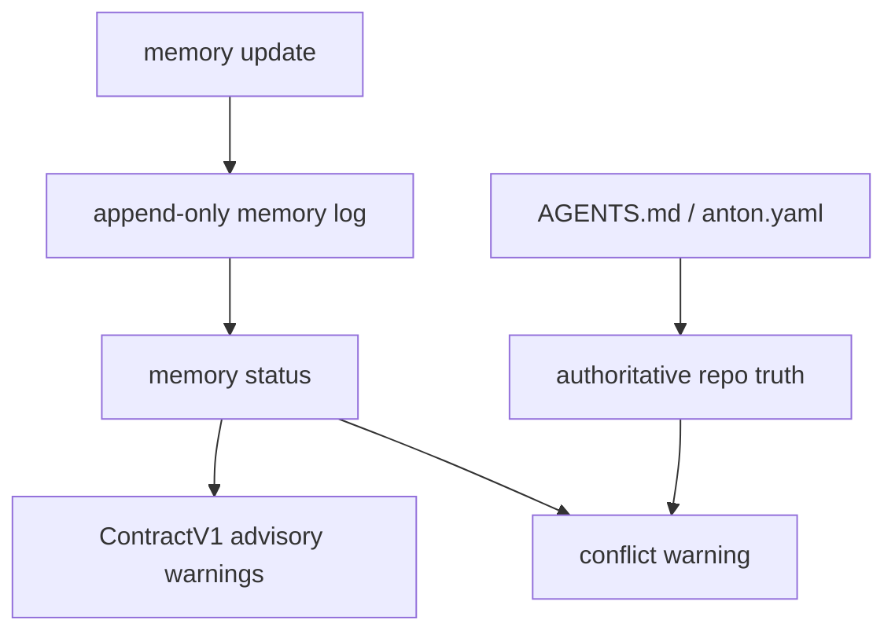

# feat: Anton memory surface

## Overview

`anton memory` should provide repo-local working memory for agents without
turning memory into hidden authority. It records useful facts, decisions, and
handoff hints with source, freshness, and confidence metadata.

This plan now satisfies the future-surface graduation gates from
`docs/plans/2026-05-08-010-feat-anton-vnext-confidence-lock-plan.md`: it defines
the command authority, append-only write boundary, JSON fixtures, exit policy,
and safety gates for the first memory slice.

## Problem Frame

Long-running agent work often fails because useful context lives only in chat or
stale handoffs. Anton can improve continuity by making working memory explicit.
The risk is that stale or agent-asserted memory can override current repo truth.
This plan keeps memory advisory by default.
The companion history plan may read `.anton/memory/events.jsonl` as one
project working-memory source, but that does not promote memory to authority.

## Requirements Trace

- R1. Store memory in a repo-local Anton-owned location by default.
- R2. Every memory fact must carry source, freshness, and confidence.
- R3. Memory cannot override `AGENTS.md`, `anton.yaml`, or authoritative
  `ContractV1` fields.
- R4. Missing memory should not block first-run context, task, or handoff flows.
- R5. Updates should be append-only or auditable.

## Scope Boundaries

- No global user memory sync in this plan.
- No background watcher.
- No automatic promotion of agent-written memory to authoritative truth.
- No rewriting `AGENTS.md` from memory entries.
- No cross-repo memory indexing.

## Context & Research

### Relevant Code and Patterns

- Future dependency: `internal/contract/*`.
- Current evidence/status receipts: `internal/taskstate/taskstate.go`.
- Current handoff package: `internal/handoff/handoff.go`.
- Command registration: `internal/app/app.go`.
- JSON fixture pattern: `internal/taskstate/testdata/golden/*.json`.

### Institutional Learnings

- `AGENTS.md` is the entrypoint source of repo instructions and should outrank
  memory.
- The gstack matrix says memory is non-authoritative by default and must not
  override `AGENTS.md`.

## Key Technical Decisions

- **Advisory by default:** Agent-written memory starts as advisory or inferred,
  not authoritative.
- **Append-only updates:** Updates preserve history so later agents can inspect
  when and why memory changed.
- **No dedupe in first slice:** Repeated memory updates are appended as separate
  audit events with distinct timestamps; pruning or compaction requires a later
  plan.
- **Conflict visibility:** If memory conflicts with repo-authoritative sources,
  Anton reports drift instead of choosing memory.
- **Missing memory is normal:** A fresh repo can run context and handoff without
  memory state.
- **Fixed first storage format:** The first slice stores append-only JSONL at
  `.anton/memory/events.jsonl`.
- **No authority promotion in first slice:** Memory records remain advisory.
  Promotion rules require a separate plan.
- **History consumption stays advisory:** `anton history sync` may normalize
  memory events into history receipts, but memory still cannot override
  `AGENTS.md`, `anton.yaml`, or `ContractV1`.

## Open Questions

### Resolved During Planning

- Should memory override entrypoint instructions? No.
- Should missing memory fail `context`? No.
- What is the first storage format? Repo-local append-only
  `.anton/memory/events.jsonl`.
- Should the first slice support authoritative promotion? No.

### Deferred to Implementation

- Retention or pruning policy.
- Exact human wording for stale/conflict warnings.

## Command Authority Matrix

| Command | Reads core contract | Reads extensions | Writes state | External execution | Authority |
|---------|---------------------|------------------|--------------|--------------------|-----------|
| `memory status` | Yes | Advisory only | No | No | Advisory memory report |
| `memory update` | Yes | Advisory only | Append-only `.anton/memory/events.jsonl` | No | Advisory continuity note |

## Failure and Exit Policy

- `memory status --json` returns `ok=true` and exit `0` when memory is missing or
  empty.
- `memory update --json` returns `ok=true` and exit `0` only after appending a
  valid record under `.anton/memory/events.jsonl`.
- Usage errors return exit `2`.
- Corrupt memory returns exit `1` for `memory status`, but must not delete or
  rewrite the corrupt file.
- Memory conflicts with `AGENTS.md`, `anton.yaml`, or `ContractV1` return
  `ok=true` with conflict warnings; memory never wins authority.

## Golden Fixture List

- `internal/memory/testdata/golden/memory_status_missing.json`
- `internal/memory/testdata/golden/memory_status_fresh.json`
- `internal/memory/testdata/golden/memory_status_stale.json`
- `internal/memory/testdata/golden/memory_conflict_entrypoint.json`
- `internal/memory/testdata/golden/memory_update_success.json`
- `internal/memory/testdata/golden/memory_corrupt.json`
- `internal/memory/testdata/golden/memory_usage_error.json`

## Start Gate

`memory status/update` may start after Slice 1 lands `ContractV1` and after the
append-only storage path is reviewed for path traversal and symlink escape.
Memory integration into `context` or `handoff` must remain advisory.

## High-Level Technical Design

> This illustrates the intended approach and is directional guidance for review,
> not implementation specification. The implementing agent should treat it as
> context, not code to reproduce.

## Implementation Units

- [ ] **Unit 1: Define memory record and storage model**

**Goal:** Create a durable, auditable memory record format.

**Requirements:** R1, R2, R5

**Dependencies:** Slice 1 contract builder.

**Files:**
- Create: `internal/memory/memory.go`
- Create: `internal/memory/memory_test.go`
- Test: `internal/memory/memory_test.go`

**Approach:**
- Define fields for key, value, source, freshness timestamp, confidence, and
  author.
- Store updates append-only at `.anton/memory/events.jsonl`.
- Keep the format simple enough for humans to inspect during handoff.

**Patterns to follow:**
- Task-state evidence receipts in `internal/taskstate/taskstate.go`.

**Test scenarios:**
- Happy path - a memory update appends a new record and preserves existing
  records.
- Edge case - duplicate value is recorded as a separate event with a clear
  timestamp policy.
- Error path - malformed memory file reports corruption without deleting data.

**Verification:**
- Memory can be read and audited without hidden mutation.

- [ ] **Unit 2: Implement memory status and conflict handling**

**Goal:** Surface memory freshness and conflicts safely.

**Requirements:** R2, R3, R4

**Dependencies:** Unit 1

**Files:**
- Modify: `internal/memory/memory.go`
- Modify: `internal/memory/memory_test.go`
- Add: `internal/memory/testdata/golden/memory_status_missing.json`
- Add: `internal/memory/testdata/golden/memory_status_fresh.json`
- Add: `internal/memory/testdata/golden/memory_status_stale.json`
- Add: `internal/memory/testdata/golden/memory_conflict_entrypoint.json`
- Add: `internal/memory/testdata/golden/memory_corrupt.json`
- Test: `internal/memory/memory_test.go`

**Approach:**
- Missing memory returns an empty advisory result.
- Stale memory is marked stale based on timestamp.
- Conflicts with `AGENTS.md` or contract-authoritative fields produce warnings.

**Patterns to follow:**
- Doctor remediation/warning style.
- Command matrix trust-level semantics.

**Test scenarios:**
- Happy path - fresh advisory memory appears with confidence and source.
- Edge case - stale memory is downgraded or warned.
- Error path - memory conflicts with entrypoint instruction and does not win.
- Integration - `context` can include memory warning metadata without failing.

**Verification:**
- Memory improves continuity while preserving repo truth.

- [ ] **Unit 3: Expose `anton memory` commands**

**Goal:** Add CLI operations for reading and updating memory.

**Requirements:** R1, R4, R5

**Dependencies:** Units 1 and 2

**Files:**
- Modify: `internal/app/app.go`
- Create: `internal/memory/command.go`
- Modify: `README.md`
- Add: `internal/memory/testdata/golden/memory_update_success.json`
- Add: `internal/memory/testdata/golden/memory_usage_error.json`
- Test: `internal/app/app_test.go`
- Test: `internal/memory/memory_test.go`

**Approach:**
- Start with `memory status` and `memory update`.
- Keep promotion and pruning out of the first slice.
- Use stable JSON envelope and concise human output.

**Patterns to follow:**
- Existing command package layout for `handoff` and `threads`.

**Test scenarios:**
- Happy path - `memory status --json` works when memory exists.
- Edge case - `memory status --json` works when memory is missing.
- Error path - invalid arguments return usage failure.
- Integration - `memory update` followed by `memory status` shows the new record.

**Verification:**
- Agents can write and read memory without changing repo policy.

## System-Wide Impact

- **Interaction graph:** Memory can feed context and handoff as advisory signal.
- **Error propagation:** Corrupt memory affects memory status but should not
  block unrelated core commands by default.
- **State lifecycle risks:** Append-only logs avoid accidental overwrite of
  previous memory.
- **API surface parity:** Memory confidence labels should match contract warning
  labels.
- **Integration coverage:** Context/handoff integration should prove memory is
  optional.
- **Unchanged invariants:** Repo entrypoints and config remain authoritative.

## Risks & Dependencies

| Risk | Mitigation |
|------|------------|
| Stale memory misleads future agents | Track freshness and downgrade stale entries. |
| Memory conflicts with repo instructions | Prefer `AGENTS.md` and emit conflict warnings. |
| Memory format becomes too complex | Start with append-only simple records. |
| Memory becomes global accidental state | Default to repo-local `.anton/memory`. |

## Documentation / Operational Notes

- Document memory as a continuity aid, not a policy layer.
- Handoff docs should mention memory confidence when memory is included.

## Sources & References

- Future surfaces roadmap: [docs/plans/2026-05-08-004-feat-anton-future-surfaces-roadmap-plan.md](docs/plans/2026-05-08-004-feat-anton-future-surfaces-roadmap-plan.md)
- Confidence lock: [docs/plans/2026-05-08-010-feat-anton-vnext-confidence-lock-plan.md](2026-05-08-010-feat-anton-vnext-confidence-lock-plan.md)
- Current task-state receipts: [internal/taskstate/taskstate.go](internal/taskstate/taskstate.go)
- Current handoff: [internal/handoff/handoff.go](internal/handoff/handoff.go)
