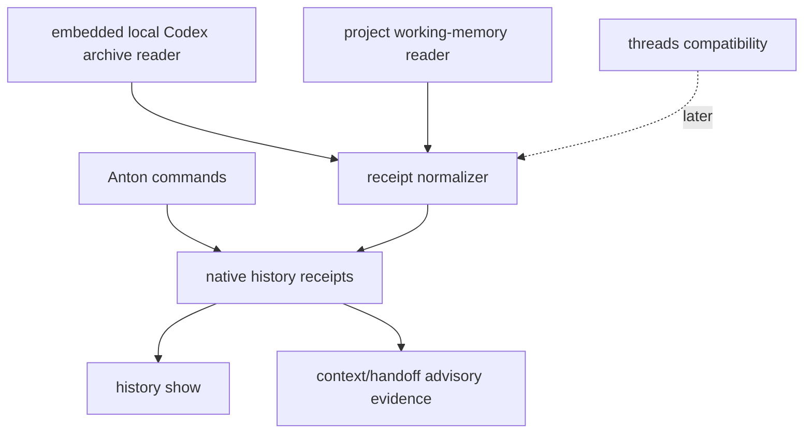

# feat: Anton history evidence surface

## Overview

`anton history` should make evidence a native Anton concept. It should store and
show Anton-owned receipts, absorb the useful local-session archive reader
behavior from `codex-threads`, and read the project's actual working memory:
canonical task bundles, Anton memory logs, and declared repo-local work-record
roots. Users should not need to install a separate `codex-threads` binary for
core history workflows. Existing `threads` commands remain compatibility
surfaces until native history is ready.

This plan now satisfies the future-surface graduation gates from
`docs/plans/2026-05-08-010-feat-anton-vnext-confidence-lock-plan.md`: it defines
native receipt storage, embedded archive authority, project working-memory
authority, fixture expectations, exit policy, and the compatibility gate for
existing `threads` commands.

## Problem Frame

Anton currently wraps `codex-threads` through `anton threads`. That was useful
for v0, but it still requires a separate binary for thread-history workflows and
only covers conversation archives. History must become an Anton-native receipt
model with an embedded local-session archive reader and a project
working-memory reader. `codex-threads` remains the MIT-licensed upstream
reference for conversation archive behavior, but Anton should own the runtime
path and should also understand the work records that live inside each project.

## Requirements Trace

- R1. Store Anton-native evidence receipts in a repo-local location.
- R2. Absorb the required `codex-threads` local archive reader behavior into
  Anton so core history workflows need no external binary install.
- R3. Normalize embedded archive data with source, freshness, confidence, and
  payload bounds.
- R4. Keep `threads` compatibility after native history exists.
- R5. Prevent archive scans, malformed sessions, or oversized payloads from
  blocking first-run context.
- R6. Normalize project working-memory records from canonical Anton task
  bundles, Anton memory logs, and declared repo-local work-record roots.

## Scope Boundaries

- No background indexing daemon.
- No cloud sync.
- No unbounded archive scans or payload output.
- No unbounded project working-memory scans or payload output.
- No Rust runtime or external `codex-threads` binary requirement for core
  `history` workflows.
- No copying without MIT attribution and source-boundary notes.
- No hard-coded downstream project paths such as `project_progress`; repo-local
  work-record roots must be declared through Anton config or extension metadata.
- No full raw conversation or work-record payload dump by default; history
  receipts should store bounded summaries, source paths, hashes, timestamps, and
  redacted excerpts only when useful.
- No deprecation of existing `threads` commands before equivalent native history
  behavior exists.

## Context & Research

### Relevant Code and Patterns

- `internal/threads/threads.go` locates and shells out to `codex-threads` for
  current compatibility commands.
- `internal/threads/threads_test.go` uses fake provider binaries for deterministic
  wrapper tests.
- `internal/taskstate/taskstate.go` already includes evidence/validation receipt
  concepts.
- `internal/handoff/handoff.go` reads task-state evidence into compact handoff
  output and is the closest current consumer of project work records.
- `internal/adapter/config.go` owns repo-local `anton.yaml` parsing and should be
  the pattern for declared working-memory roots.
- Future dependency: `internal/contract/*`.
- Upstream reference: the sibling `../codex-threads` checkout is a Rust/Cargo
  project under the MIT license.

### Institutional Learnings

- `AGENTS.md` now treats `codex-threads` as an upstream source surface: Anton may
  absorb compatible archive-reader behavior with attribution, but must not
  become a repo-specific wrapper or overwrite the upstream project.
- The vNext review says history should be Anton-native receipts, not a renamed
  wrapper.

## Key Technical Decisions

- **Native receipts first:** History stores Anton-owned receipts and can operate
  with only local archive data and repo-local work records.
- **Embedded archive reader:** Core history commands read local Codex session
  archives directly through Anton-owned Go code. The implementation may port the
  required MIT `codex-threads` behavior, but Anton releases must not require a
  separate `codex-threads` install.
- **Bounded archive data:** Session archive reads must have scan limits, payload
  size caps, and malformed-session isolation.
- **Deterministic receipt ids:** `history sync` uses stable source/content hashes
  to avoid duplicate receipts on repeat sync while keeping the store append-only.
- **Project working memory is first-class:** Core history reads canonical
  `.anton/tasks/...` bundles, `.anton/memory/events.jsonl` when present, and
  explicitly declared repo-local work-record roots into the same receipt model.
- **Bounded project records:** Working-memory reads must use root allowlists,
  file-count caps, payload caps, traversal checks, and symlink-escape checks.
- **Declared work-record root schema:** First-slice declared roots use
  `extensions.history.work_record_roots` as a list of repo-relative paths. Roots
  outside the repo, absolute paths, traversal, and symlink escapes are refused.
- **Privacy-preserving payloads:** Receipts store metadata and bounded summaries
  by default. Secret-looking values, tokens, and raw long-form content are
  redacted or represented by hash before appearing in JSON output.
- **Threads compatibility waits:** Existing `threads` commands should emit
  deprecation only after native history can cover the same use cases.
- **Fixed first receipt store:** The first slice stores append-only native
  receipts at `.anton/history/receipts.jsonl`.
- **First embedded source is local Codex sessions:** The first archive source is
  the local Codex session tree currently handled by `codex-threads`. Additional
  providers require separate authority entries.
- **First project sources are canonical and declared:** The first project
  working-memory sources are `.anton/tasks/**`, `.anton/memory/events.jsonl`,
  and declared repo-local work-record roots.
- **No deprecation in first history slice:** Existing `threads` commands keep
  current behavior and exit codes while native history proves parity.

## Open Questions

### Resolved During Planning

- Should `history` just rename `threads`? No.
- Should core history require installing `codex-threads`? No.
- What is the first native receipt store? `.anton/history/receipts.jsonl`.
- What archive source ships first? Embedded local Codex session reader, ported
  from or aligned with MIT `codex-threads` behavior.
- What project working-memory sources ship first? Canonical Anton task bundles,
  Anton memory logs when available, and declared repo-local work-record roots.
- What is the first declared root schema? `extensions.history.work_record_roots`,
  repo-relative paths only.
- When do `threads` deprecation warnings begin? Not in the first history slice.

### Deferred to Implementation

- Exact non-core receipt payload fields.
- Exact human wording for archive warnings and future mapping docs.

## Command Authority Matrix

| Command | Reads core contract | Reads extensions | Writes state | External execution | Authority |
|---------|---------------------|------------------|--------------|--------------------|-----------|
| `history show` | Yes | Advisory archive and working-memory metadata | No | No | Advisory evidence report |
| `history sync` | Yes | Advisory archive and working-memory metadata | Append-only `.anton/history/receipts.jsonl` | No external binary; bounded local session and repo record reads | Advisory embedded evidence |
| `threads *` compatibility | No new contract authority | No | No | Existing bounded wrapper behavior | Compatibility surface |

## Failure and Exit Policy

- `history show --json` returns `ok=true` and exit `0` when the receipt store is
  missing or empty.
- `history sync --json` returns `ok=true` and exit `0` when local Codex sessions
  and project working-memory roots are scanned within bounds and normalized
  receipts are appended or already up to date.
- Missing session root returns `ok=true` with an empty/advisory result, not a
  missing-binary failure.
- Missing optional working-memory roots return `ok=true` with advisory warnings.
- Malformed session files, oversized payloads, and scan-limit truncation return
  structured warnings and must not corrupt existing receipts.
- Malformed `status.yaml`, malformed memory JSONL, symlink escape, traversal, and
  project-record scan-limit truncation return structured warnings and must not
  corrupt existing receipts.
- Repeat `history sync` over unchanged sources returns `ok=true` and appends no
  duplicate receipts.
- Secret-looking values or raw payloads that exceed safe output bounds are
  redacted or hashed in JSON output.
- Unsupported external provider import is not part of this slice.
- Existing `threads` command exit codes remain unchanged in the first history
  slice.

## Golden Fixture List

- `internal/history/testdata/golden/history_show_empty.json`
- `internal/history/testdata/golden/history_show_success.json`
- `internal/history/testdata/golden/history_sync_success.json`
- `internal/history/testdata/golden/history_sync_idempotent.json`
- `internal/history/testdata/golden/history_sync_missing_sessions.json`
- `internal/history/testdata/golden/archive_malformed_session.json`
- `internal/history/testdata/golden/archive_oversized_payload.json`
- `internal/history/testdata/golden/archive_scan_limited.json`
- `internal/history/testdata/golden/history_sync_task_bundle_success.json`
- `internal/history/testdata/golden/history_sync_declared_worklog_success.json`
- `internal/history/testdata/golden/working_memory_missing_root.json`
- `internal/history/testdata/golden/working_memory_malformed_status.json`
- `internal/history/testdata/golden/working_memory_symlink_escape.json`
- `internal/history/testdata/golden/working_memory_undeclared_root_ignored.json`
- `internal/history/testdata/golden/working_memory_secret_redaction.json`
- `internal/history/testdata/golden/history_usage_error.json`
- Existing `internal/threads/testdata/golden/*.json` fixtures remain active for
  compatibility.

## Start Gate

`history show/sync` may start after Slice 1 lands `ContractV1`, after MIT
attribution for absorbed `codex-threads` behavior is recorded, and after the
append-only receipt path, deterministic receipt id policy, scan limits,
output-size caps, redaction policy, and `extensions.history.work_record_roots`
schema are fixed in tests. No `threads` deprecation warning may land until
native history covers the same user-facing workflows.

## High-Level Technical Design

> This illustrates the intended approach and is directional guidance for review,
> not implementation specification. The implementing agent should treat it as
> context, not code to reproduce.

## Implementation Units

- [ ] **Unit 1: Define native history receipt store**

**Goal:** Create an append-only evidence receipt model owned by Anton.

**Requirements:** R1, R3

**Dependencies:** Slice 1 contract builder and task-state receipt conventions.

**Files:**
- Create: `internal/history/history.go`
- Create: `internal/history/history_test.go`
- Test: `internal/history/history_test.go`

**Approach:**
- Define receipt fields for id, type, timestamp, source, confidence, and payload.
- Compute receipt ids from stable source identity plus normalized content hash so
  repeated syncs are idempotent without rewriting the receipt store.
- Keep storage append-only and bounded at `.anton/history/receipts.jsonl`.
- Support empty receipt stores cleanly.

**Patterns to follow:**
- Evidence receipts in `internal/taskstate/taskstate.go`.
- Golden JSON helpers in `internal/threads/threads_test.go`.

**Test scenarios:**
- Happy path - append and read a native receipt.
- Edge case - empty receipt store returns `ok=true` with no receipts.
- Error path - malformed receipt file reports corruption without deleting data.

**Verification:**
- Anton can show history without depending on `codex-threads`.

- [ ] **Unit 2: Embed local Codex archive reader**

**Goal:** Normalize local Codex session archives into Anton receipts without an
external `codex-threads` binary.

**Requirements:** R2, R3, R5

**Dependencies:** Unit 1

**Files:**
- Create: `internal/history/archive.go`
- Modify: `internal/history/history_test.go`
- Add: `internal/history/testdata/golden/history_sync_missing_sessions.json`
- Add: `internal/history/testdata/golden/archive_malformed_session.json`
- Add: `internal/history/testdata/golden/archive_oversized_payload.json`
- Add: `internal/history/testdata/golden/archive_scan_limited.json`
- Add: `internal/history/NOTICE.md`
- Test: `internal/history/history_test.go`

**Approach:**
- Port or reimplement the required local-session discovery, parsing, and
  summarization behavior from the MIT `codex-threads` codebase into Go.
- Include MIT attribution for copied or substantially derived code.
- Record copied or substantially derived upstream behavior in
  `internal/history/NOTICE.md`.
- Enforce scan limits, per-message character caps, and output-size limits.
- Convert malformed session files to warnings by default.

**Patterns to follow:**
- Existing `codex-threads` Rust archive semantics in `../codex-threads/src/main.rs`.
- Existing insights data modeling in `../codex-threads/src/insights.rs`.
- Existing error payload patterns in Anton command packages.

**Test scenarios:**
- Happy path - local session archive sync creates normalized receipts.
- Edge case - missing session root returns empty/advisory result.
- Error path - malformed session JSONL returns warning and continues.
- Edge case - oversized message payload is truncated or refused with a warning.
- Performance - scan limit prevents unbounded archive traversal.

**Verification:**
- Core history works in a released Anton binary without an external
  `codex-threads` install.

- [ ] **Unit 3: Add project working-memory reader**

**Goal:** Normalize repo-local work records into Anton history receipts.

**Requirements:** R1, R3, R6

**Dependencies:** Unit 1 and Slice 1 `ContractV1`

**Files:**
- Create: `internal/history/workmemory.go`
- Modify: `internal/history/history_test.go`
- Add: `internal/history/testdata/golden/history_sync_task_bundle_success.json`
- Add: `internal/history/testdata/golden/history_sync_declared_worklog_success.json`
- Add: `internal/history/testdata/golden/working_memory_missing_root.json`
- Add: `internal/history/testdata/golden/working_memory_malformed_status.json`
- Add: `internal/history/testdata/golden/working_memory_symlink_escape.json`
- Add: `internal/history/testdata/golden/working_memory_undeclared_root_ignored.json`
- Add: `internal/history/testdata/golden/working_memory_secret_redaction.json`
- Test: `internal/history/history_test.go`

**Approach:**
- Read canonical Anton task bundles from the configured task root, including
  `task_plan.md`, `findings.md`, `progress.md`, and `status.yaml`.
- Read `.anton/memory/events.jsonl` when the memory surface exists.
- Read declared repo-local work-record roots through
  `extensions.history.work_record_roots`, with traversal, symlink, file-count,
  and payload caps.
- Normalize each project record into receipts with source type, path, freshness,
  confidence, provenance, and bounded payload summary.
- Do not hard-code `project_progress`; repos that use a `project_progress`-style
  tree can declare it as a work-record root.
- Redact secret-looking values and avoid emitting full raw file content in JSON
  output.

**Patterns to follow:**
- Task bundle shape and status parsing in `internal/taskstate/taskstate.go`.
- Handoff evidence consumption in `internal/handoff/handoff.go`.
- Strict config parsing and unknown-field handling in `internal/adapter/config.go`.

**Test scenarios:**
- Happy path - canonical `.anton/tasks/...` bundle creates project-work receipts.
- Happy path - declared `project_progress`-style root syncs only when declared.
- Edge case - missing optional work-record root returns advisory warning.
- Edge case - undeclared project worklog roots are ignored.
- Error path - malformed `status.yaml` warns and continues.
- Error path - symlink escape or path traversal is refused.
- Security - secret-looking values are redacted or hashed in receipts.

**Verification:**
- `history sync` reflects actual project work records, not only conversation
  history.

- [ ] **Unit 4: Add `anton history show/sync` CLI**

**Goal:** Expose native receipts and embedded archive sync through stable
commands.

**Requirements:** R1, R2, R4, R6

**Dependencies:** Units 1, 2, and 3

**Files:**
- Modify: `internal/app/app.go`
- Create: `internal/history/command.go`
- Modify: `README.md`
- Add: `internal/history/testdata/golden/history_show_empty.json`
- Add: `internal/history/testdata/golden/history_show_success.json`
- Add: `internal/history/testdata/golden/history_sync_success.json`
- Add: `internal/history/testdata/golden/history_sync_idempotent.json`
- Add: `internal/history/testdata/golden/history_sync_task_bundle_success.json`
- Add: `internal/history/testdata/golden/history_sync_declared_worklog_success.json`
- Add: `internal/history/testdata/golden/history_usage_error.json`
- Test: `internal/app/app_test.go`
- Test: `internal/history/history_test.go`

**Approach:**
- Add `history show` for native receipts.
- Add `history sync` for embedded local Codex archive ingestion.
- Add `history sync` ingestion for canonical task bundles, Anton memory logs, and
  declared project work-record roots.
- Keep JSON stable and human output compact.

**Patterns to follow:**
- Existing `threads recent/insights/brief` output semantics as compatibility
  references, not as runtime dependencies.

**Test scenarios:**
- Happy path - `history show --json` returns native receipts.
- Happy path - `history sync --json` ingests local Codex session archives without
  invoking `codex-threads`.
- Happy path - `history sync --json` ingests project working-memory records
  without scanning undeclared repo paths.
- Edge case - repeated `history sync --json` over unchanged sources appends no
  duplicate receipts.
- Error path - unsupported provider-style subcommand returns usage failure
  because external providers are not in this slice.
- Regression - existing `threads` commands still work.

**Verification:**
- `history` can replace wrapper-first evidence workflows without an extra
  `codex-threads` install.

- [ ] **Unit 5: Plan threads compatibility migration**

**Goal:** Keep old `threads` commands stable while pointing users toward native
history once parity exists.

**Requirements:** R4, R5

**Dependencies:** Unit 4

**Files:**
- Modify: `internal/threads/threads.go`
- Modify: `internal/threads/threads_test.go`
- Modify: `README.md`
- Test: `internal/threads/threads_test.go`

**Approach:**
- Do not add deprecation warnings in the first history slice.
- Add deprecation warnings only in a later slice when native history commands can
  cover the equivalent use case.
- Keep exit codes unchanged for compatibility.
- Map each old command to a future history workflow in docs.

**Patterns to follow:**
- Current `threads` wrapper response payloads and fixture tests.

**Test scenarios:**
- Regression - `threads doctor/recent/insights/brief/recipe` still return the
  expected payloads.
- Integration - deprecation warning appears only after history parity exists.
- Error path - compatibility wrapper failures remain scoped and actionable.

**Verification:**
- Existing automation is not broken while Anton's product center moves to native
  history.

## System-Wide Impact

- **Interaction graph:** Native history can feed context, handoff, memory, and
  adopt as advisory evidence.
- **Error propagation:** Archive and project working-memory read failures are
  warnings unless explicitly fatal for the requested sync operation.
- **State lifecycle risks:** Receipt stores are append-only and should not mutate
  task lifecycle state directly.
- **API surface parity:** Threads compatibility remains until history parity is
  real.
- **Integration coverage:** Missing sessions, malformed sessions, missing
  work-record roots, malformed task status, scan limits, symlink escapes, and
  oversized cases need fixtures.
- **Unchanged invariants:** Anton owns its history runtime, but it does not
  overwrite the upstream `codex-threads` project.

## Risks & Dependencies

| Risk | Mitigation |
|------|------------|
| History becomes just a renamed wrapper | Embed archive reading into native history and keep receipts Anton-owned. |
| Archive scans hang core commands | Use bounded traversal, payload caps, and no background daemon. |
| History misses the real project work trail | Ingest canonical task bundles, Anton memory logs, and declared work-record roots in the first native history slice. |
| Repo-specific work records leak into Anton core | Require declared roots and keep names like `project_progress` out of core defaults. |
| History leaks sensitive work content | Store bounded summaries, hashes, and redacted excerpts instead of full raw payloads. |
| Repeated sync floods receipts | Use deterministic source/content ids and idempotent append-only writes. |
| Deprecated threads breaks users | Keep exit codes and behavior stable until parity exists. |
| Imported evidence looks authoritative | Store source/freshness/confidence on each receipt. |
| Absorbed code loses provenance | Keep source-boundary notes for the original `codex-threads` implementation. |

## Documentation / Operational Notes

- README should explain native history as built-in and `threads` as compatibility.
- Deprecation docs should provide direct command mappings only after parity lands.

## Sources & References

- Future surfaces roadmap: [docs/plans/2026-05-08-004-feat-anton-future-surfaces-roadmap-plan.md](docs/plans/2026-05-08-004-feat-anton-future-surfaces-roadmap-plan.md)
- Confidence lock: [docs/plans/2026-05-08-010-feat-anton-vnext-confidence-lock-plan.md](2026-05-08-010-feat-anton-vnext-confidence-lock-plan.md)
- Current threads surface: [internal/threads/threads.go](internal/threads/threads.go)
- Current task-state receipts: [internal/taskstate/taskstate.go](internal/taskstate/taskstate.go)
- Current handoff evidence consumer: [internal/handoff/handoff.go](internal/handoff/handoff.go)
- Current config parser: [internal/adapter/config.go](internal/adapter/config.go)
- Upstream codex-threads repo: `../codex-threads`
- Upstream codex-threads license: `../codex-threads/LICENSE`
