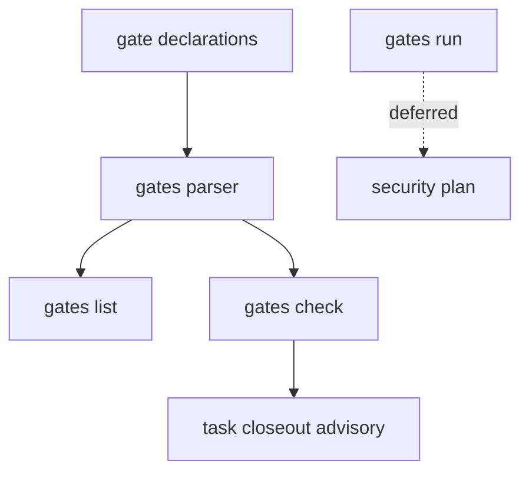

# feat: Anton declarative gates surface

## Overview

`anton gates` should make validation and closeout expectations visible before
Anton executes anything. The first gates slice is declarative only:
`gates list` and `gates check`. Runnable gates require a separate security plan.

This plan now satisfies the future-surface graduation gates from
`docs/plans/2026-05-08-010-feat-anton-vnext-confidence-lock-plan.md`: it fixes
the first declaration location, command authority, fixture list, exit policy,
and the explicit block on `gates run`.

## Problem Frame

Agents need to know what must be true before a task is done. Without a gates
surface, closeout rules live in docs and are easy to miss. But running
repo-declared commands is a security and reliability boundary. This plan exposes
gates as contract-visible declarations first.

## Requirements Trace

- R1. Read declared gate metadata from `anton.yaml` or `.anton/gates`.
- R2. List gates and evaluate declaration completeness without executing them.
- R3. Keep gate failures and missing gates visible to task closeout logic.
- R4. Reject or warn on unsafe declaration shapes before any future runner exists.
- R5. Defer `gates run` until command execution safety is separately planned.

## Scope Boundaries

- No command execution in this plan.
- No shell interpolation.
- No destructive-command allowlist.
- No CI replacement.
- No automatic task closure based on gates.

## Context & Research

### Relevant Code and Patterns

- Current task closure gates live in `internal/taskstate/taskstate.go`.
- Future contract integration depends on `internal/contract/*`.
- Config parsing lives in `internal/adapter/config.go`.
- Command registration lives in `internal/app/app.go`.

### Institutional Learnings

- The vNext review identified unsafe gates as a critical risk.
- The command matrix explicitly says gates should be declarative in the first
  slice, with `run --safe` deferred.

## Key Technical Decisions

- **Declarative first:** `gates list/check` reads declarations and reports status
  but never executes commands.
- **Typed declarations:** Even before execution exists, gate declarations should
  have typed fields instead of unstructured shell strings.
- **Closeout visibility:** Task closeout can reference gate status, but this plan
  does not make gates automatically close or block tasks without a clear policy.
- **Security before runner:** Runnable gates require a later security-focused
  plan.
- **First declaration source:** The first slice reads gate declarations from
  `anton.yaml` only. `.anton/gates/*.yaml` can be added later after merge and
  precedence rules are specified.
- **Required gates fail only `gates check`:** Malformed required declarations can
  make `gates check` fail, but they do not automatically close or block
  `task-state` in this slice.

## Open Questions

### Resolved During Planning

- Should `gates run` ship in the first gates slice? No.
- Should gates be allowed as free-form shell strings? No.
- Where do first-slice gates live? `anton.yaml` only.
- Does `gates check` mutate or close tasks? No.

### Deferred to Implementation

- Exact non-core description fields in the declaration schema.
- Whether `.anton/gates/*.yaml` becomes a later declaration source.
- Exact later policy for task closeout blocking.

## Command Authority Matrix

| Command | Reads core contract | Reads extensions | Writes state | External execution | Authority |
|---------|---------------------|------------------|--------------|--------------------|-----------|
| `gates list` | Yes | Reads `anton.yaml` gate metadata only | No | No | Declarative visibility |
| `gates check` | Yes | Reads `anton.yaml` gate metadata only | No | No | Declarative completeness check |
| `gates run` | Blocked | Blocked until security plan | Blocked | Blocked | Not approved |

## Failure and Exit Policy

- `gates list --json` returns `ok=true` and exit `0` when no gates are declared.
- `gates check --json` returns `ok=true` and exit `0` when declarations are valid
  or only optional gates are missing.
- Malformed required declarations return exit `1` with structured config-style
  findings.
- Usage errors return exit `2`.
- Shell-like command content is inert metadata in this slice; it is never
  executed.

## Golden Fixture List

- `internal/gates/testdata/golden/gates_list_empty.json`
- `internal/gates/testdata/golden/gates_list_success.json`
- `internal/gates/testdata/golden/gates_check_success.json`
- `internal/gates/testdata/golden/gates_check_missing_required.json`
- `internal/gates/testdata/golden/gates_check_malformed.json`
- `internal/gates/testdata/golden/gates_check_unsafe_inert.json`
- `internal/gates/testdata/golden/gates_usage_error.json`

## Start Gate

`gates list/check` may start after Slice 1 lands `ContractV1` and after the
`anton.yaml` gate schema is added to strict config validation. `gates run` remains
blocked until a separate security plan exists.

## High-Level Technical Design

> This illustrates the intended approach and is directional guidance for review,
> not implementation specification. The implementing agent should treat it as
> context, not code to reproduce.

## Implementation Units

- [ ] **Unit 1: Define gate declaration model**

**Goal:** Create typed gate metadata that Anton can list and validate without
executing.

**Requirements:** R1, R2, R4

**Dependencies:** Shared contract and config v2 direction.

**Files:**
- Create: `internal/gates/gates.go`
- Create: `internal/gates/gates_test.go`
- Test: `internal/gates/gates_test.go`

**Approach:**
- Model gate name, type, required_for, description, command metadata, timeout
  metadata, and destructive flag if present.
- Treat execution fields as inert metadata in this slice.
- Detect unsafe declaration shapes early.
- Read declarations from `anton.yaml` only in the first slice.

**Patterns to follow:**
- Config validation style in `internal/adapter/config.go`.
- Task closure gate reporting in `internal/taskstate/taskstate.go`.

**Test scenarios:**
- Happy path - valid declarative gate parses and lists required fields.
- Edge case - missing optional command metadata still lists as declarative only.
- Error path - malformed gate declaration reports config-style failure.
- Security - shell metacharacters are not executed and can be flagged as unsafe
  declaration content.

**Verification:**
- Gate declarations are visible and inert.

- [ ] **Unit 2: Add `gates list/check` CLI**

**Goal:** Expose gate declarations and completeness checks through Anton CLI.

**Requirements:** R1, R2, R3

**Dependencies:** Unit 1

**Files:**
- Create: `internal/gates/command.go`
- Modify: `internal/app/app.go`
- Modify: `README.md`
- Add: `internal/gates/testdata/golden/gates_list_success.json`
- Add: `internal/gates/testdata/golden/gates_list_empty.json`
- Add: `internal/gates/testdata/golden/gates_check_success.json`
- Add: `internal/gates/testdata/golden/gates_check_missing_required.json`
- Add: `internal/gates/testdata/golden/gates_check_malformed.json`
- Add: `internal/gates/testdata/golden/gates_check_unsafe_inert.json`
- Add: `internal/gates/testdata/golden/gates_usage_error.json`
- Test: `internal/app/app_test.go`
- Test: `internal/gates/gates_test.go`

**Approach:**
- `gates list` shows declarations.
- `gates check` reports missing or incomplete declarations and whether they are
  relevant to closeout.
- Missing gates should not fail unrelated commands.

**Patterns to follow:**
- `threads doctor/recent` subcommand routing.
- Existing golden JSON fixtures.

**Test scenarios:**
- Happy path - list returns declared gates.
- Edge case - no gates configured returns empty list or advisory status.
- Error path - malformed gate config returns structured config failure.
- Integration - task closeout can consume check output later without a new
  schema.

**Verification:**
- Agents can inspect closeout expectations before claiming done.

- [ ] **Unit 3: Prepare but defer runner security**

**Goal:** Document what must be true before `gates run` can exist.

**Requirements:** R4, R5

**Dependencies:** Unit 2

**Files:**
- Modify: `docs/plans/2026-05-08-008-feat-anton-declarative-gates-surface-plan.md`
- Future create: separate security plan for `gates run`
- Test: none

**Approach:**
- Record runner prerequisites: typed command declarations, timeout, output cap,
  destructive-command refusal, no shell interpolation, and append-only run
  receipts.
- Keep runner out of this implementation slice.

**Patterns to follow:**
- Safety refusal concepts in the command matrix.

**Test scenarios:**
- Test expectation: none - this unit is planning-only guardrail documentation.

**Verification:**
- Reviewers can reject any `gates run` implementation until the security plan
  exists.

## System-Wide Impact

- **Interaction graph:** Gates can inform contract and task closeout as
  declarative metadata.
- **Error propagation:** Malformed required gate declarations are config-like
  failures; missing optional gates are warnings.
- **State lifecycle risks:** Gates do not mutate task state in this slice.
- **API surface parity:** Future runner must use the same gate model.
- **Integration coverage:** Tests should cover no gates, valid gates, malformed
  gates, and unsafe declaration content.
- **Unchanged invariants:** Anton does not become CI or a shell runner here.

## Risks & Dependencies

| Risk | Mitigation |
|------|------------|
| Gates become unsafe command execution | Ship only list/check and defer run. |
| Gate declarations are too free-form | Use typed schema and parse-time validation. |
| Closeout blocks on optional gates | Track required_for metadata explicitly. |
| Future runner ignores declarative model | Document runner as dependent on this model. |

## Documentation / Operational Notes

- README should say gates are declarative only until `gates run` is separately
  designed.
- Any future runner plan must include security review.

## Sources & References

- Future surfaces roadmap: [docs/plans/2026-05-08-004-feat-anton-future-surfaces-roadmap-plan.md](docs/plans/2026-05-08-004-feat-anton-future-surfaces-roadmap-plan.md)
- Confidence lock: [docs/plans/2026-05-08-010-feat-anton-vnext-confidence-lock-plan.md](2026-05-08-010-feat-anton-vnext-confidence-lock-plan.md)
- Current task-state close behavior: [internal/taskstate/taskstate.go](internal/taskstate/taskstate.go)
- Current config parser: [internal/adapter/config.go](internal/adapter/config.go)
