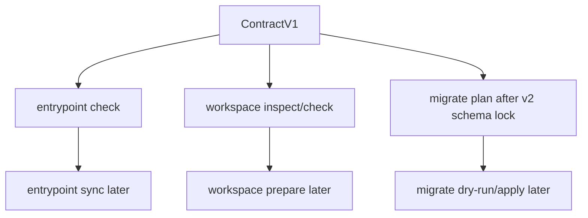

# feat: Anton maintenance surfaces

## Overview

This plan covers later maintenance surfaces: `entrypoint`, `workspace`, and
`migrate`. These commands help repos keep their Anton harness usable over time,
but they should land after the contract, task, memory/history, and safety
foundations are stable.

This plan now satisfies the future-surface graduation gates from
`docs/plans/2026-05-08-010-feat-anton-vnext-confidence-lock-plan.md` for
`entrypoint check` and `workspace inspect/check`. `migrate plan` remains planned,
but it is not start-approved until the v2 config schema is locked. Mutating
commands remain blocked.

## Problem Frame

Anton repos need more than one-time bootstrap. Entrypoints drift, workspaces need
safe local preparation, and config schemas evolve. These surfaces are useful but
write-capable or path-sensitive, so they need explicit inspect/plan/check modes
before any mutating operations.

## Requirements Trace

- R1. `entrypoint check` should validate entrypoint docs against the contract
  before any sync command edits them.
- R2. `workspace inspect/check` should report local agent workspaces safely before
  `workspace prepare` writes directories.
- R3. `migrate plan` should preview config/layout changes before `migrate apply`.
- R4. All path-sensitive commands must defend against traversal, symlink escape,
  and prefix collisions.
- R5. All write-capable commands need idempotency and rollback expectations.

## Scope Boundaries

- No entrypoint rewrite in the first entrypoint slice.
- No workspace deletion or cleanup.
- No migration apply before migration plan and dry-run validators exist.
- No hosted state or remote workspace management.
- No changes to project source files outside declared harness paths.

## Context & Research

### Relevant Code and Patterns

- Entrypoint path resolution: `internal/adapter/default.go`.
- Config parsing and strict validation: `internal/adapter/config.go`.
- Workspace root behavior currently appears in `threads` project inference.
- Path validation examples exist in task id and retarget logic.
- Command dispatch lives in `internal/app/app.go`.

### Institutional Learnings

- `AGENTS.md` says `AGENTS.md` and README should remain short, with detailed
  design in docs.
- The vNext matrix warns about workspace prefix collisions and migration rollback
  requirements.
- Existing v0 plans defer entrypoint sync until the canonical contract is stable.

## Key Technical Decisions

- **Check before sync:** `entrypoint check` lands before `entrypoint sync`.
- **Inspect before prepare:** `workspace inspect/check` lands before any more
  write-heavy workspace workflow.
- **Plan before apply:** `migrate plan` and dry-run validators land before
  `migrate apply`, but only after the target v2 config schema is locked.
- **Path safety is core:** Maintenance surfaces must use safe path resolution,
  not string prefix checks.
- **Rollback before migration writes:** Any future migration apply must snapshot
  existing config before writing.
- **Fixed first entrypoint budget:** `entrypoint check` uses a default budget of
  120 lines unless `anton.yaml` later declares a different value.
- **Fixed first workspace schema:** First-slice workspace checks use configured
  `threads.workspace_roots` as read-only workspace roots; a dedicated
  `workspace.roots` config section belongs to a later config version.
- **Migration preview waits for schema lock:** `migrate plan` previews
  v1-to-v2 config shape only after the v2 shape is specified in a config-schema
  plan; it does not write v2 config.

## Open Questions

### Resolved During Planning

- Should entrypoint sync be part of the first maintenance slice? No.
- Should migration apply be available without dry-run? No.
- Should workspace prepare be allowed outside declared roots? No.
- What entrypoint budget is used first? 120 lines by default.
- What workspace schema is used first? Existing `threads.workspace_roots`, read
  only.
- What migration target is first? v1-to-v2 preview only, after v2 schema lock.

### Deferred to Implementation

- Whether maintenance surfaces are one command family or separate packages.
- Exact later idempotency implementation for `sync`, `prepare`, and `apply`.

## Command Authority Matrix

| Command | Reads core contract | Reads extensions | Writes state | External execution | Authority |
|---------|---------------------|------------------|--------------|--------------------|-----------|
| `entrypoint check` | Yes | Advisory only | No | No | Entrypoint drift check |
| `entrypoint sync` | Blocked | Blocked until sync plan | Blocked | No | Not approved |
| `workspace inspect` | Yes | Advisory only | No | No | Workspace visibility |
| `workspace check` | Yes | Advisory only | No | No | Workspace path safety check |
| `workspace prepare` | Blocked | Blocked until safety plan | Blocked | No | Not approved |
| `migrate plan` | Yes after v2 schema lock | Reads config version only | No | No | Migration preview, not start-approved until schema lock |
| `migrate apply` | Blocked | Blocked until rollback plan | Blocked | No | Not approved |

## Failure and Exit Policy

- `entrypoint check --json` returns exit `0` when the primary entrypoint exists
  and required references pass; missing primary entrypoint returns exit `1`.
- `workspace inspect --json` returns exit `0` for empty or configured workspace
  roots; path traversal or symlink escape findings return exit `1` in
  `workspace check`.
- `migrate plan --json` returns exit `0` when the v2 schema is locked and it can
  preview a migration without writing; invalid YAML or unsupported config
  versions return exit `1`.
- Before the v2 schema lock exists, `migrate plan --json` must return a
  not-approved/blocked response rather than inventing field names.
- Usage errors return exit `2`.
- `sync`, `prepare`, and `apply` subcommands must return usage/not-approved
  failures until their separate safety plans land.

## Golden Fixture List

- `internal/entrypoint/testdata/golden/entrypoint_check_success.json`
- `internal/entrypoint/testdata/golden/entrypoint_check_missing.json`
- `internal/entrypoint/testdata/golden/entrypoint_check_over_budget.json`
- `internal/workspace/testdata/golden/workspace_inspect_empty.json`
- `internal/workspace/testdata/golden/workspace_inspect_success.json`
- `internal/workspace/testdata/golden/workspace_check_prefix_collision.json`
- `internal/workspace/testdata/golden/workspace_check_symlink_escape.json`
- `internal/migrate/testdata/golden/migrate_plan_v1_to_v2.json`
- `internal/migrate/testdata/golden/migrate_plan_schema_not_locked.json`
- `internal/migrate/testdata/golden/migrate_plan_invalid_yaml.json`
- `internal/migrate/testdata/golden/migrate_apply_not_approved.json`

## Start Gate

`entrypoint check` and `workspace inspect/check` may start after Slice 1 lands
`ContractV1` and after path canonicalization helpers are available for
traversal, symlink, and prefix-collision tests. `migrate plan` additionally
requires a locked v2 config schema. `entrypoint sync`, `workspace prepare`, and
`migrate apply` remain blocked until separate rollback/idempotency plans exist.

## High-Level Technical Design

> This illustrates the intended approach and is directional guidance for review,
> not implementation specification. The implementing agent should treat it as
> context, not code to reproduce.

## Implementation Units

- [ ] **Unit 1: Plan `entrypoint check`**

**Goal:** Validate repo entrypoint docs against Anton contract expectations.

**Requirements:** R1, R4

**Dependencies:** Shared contract builder.

**Files:**
- Future create: `internal/entrypoint/entrypoint.go`
- Future create: `internal/entrypoint/entrypoint_test.go`
- Modify: `internal/app/app.go`
- Modify: `README.md`
- Test: `internal/entrypoint/entrypoint_test.go`

**Approach:**
- Read configured `entrypoint.path`.
- Check existence, the 120-line default size budget, and required references.
- Report unresolved references without editing files.

**Patterns to follow:**
- Entrypoint resolution in `internal/adapter/default.go`.
- Doctor entrypoint check style.

**Test scenarios:**
- Happy path - configured entrypoint exists and passes checks.
- Edge case - missing optional compatibility entrypoint is warning only.
- Error path - missing primary entrypoint returns check failure.
- Integration - entrypoint path matches `ContractV1`.

**Verification:**
- Repos can see entrypoint drift before sync exists.

- [ ] **Unit 2: Plan `workspace inspect/check` and safe prepare**

**Goal:** Make local agent workspace roots inspectable and safely preparable.

**Requirements:** R2, R4, R5

**Dependencies:** Shared contract builder and config v2 workspace fields.

**Files:**
- Future create: `internal/workspace/workspace.go`
- Future create: `internal/workspace/workspace_test.go`
- Modify: `internal/app/app.go`
- Modify: `README.md`
- Test: `internal/workspace/workspace_test.go`

**Approach:**
- `workspace inspect` reports read-only workspace roots from
  `threads.workspace_roots` and discovered projects.
- `workspace check` validates path boundaries and root health.
- `workspace prepare` remains blocked until a separate write-safety plan exists.

**Patterns to follow:**
- Current workspace root inference in `internal/adapter/default.go`.
- Task retarget path escape checks.

**Test scenarios:**
- Happy path - workspace under declared root is detected.
- Edge case - `.anton/workspaces/foo` does not match `.anton/workspaces/foobar`.
- Error path - `../` project name is refused.
- Security - symlink escape is detected and refused.

**Verification:**
- Workspace operations cannot write or infer paths outside declared roots.

- [ ] **Unit 3: Plan `migrate plan` and dry-run**

**Goal:** Preview `anton.yaml` and layout migrations safely.

**Requirements:** R3, R4, R5

**Dependencies:** Stable config v2 schema decisions.

**Files:**
- Future create: `internal/migrate/migrate.go`
- Future create: `internal/migrate/migrate_test.go`
- Modify: `internal/app/app.go`
- Modify: `README.md`
- Test: `internal/migrate/migrate_test.go`

**Approach:**
- `migrate plan` reads current config and reports proposed changes.
- If v2 schema is not locked, `migrate plan` reports a blocked/not-approved
  result instead of inventing target fields.
- Dry-run validators check schema and write safety without mutating files.
- `migrate apply` is deferred until rollback behavior is specified and tested.
- The first migration preview is v1-to-v2 shape only and must preserve or reject
  unknown fields explicitly.

**Patterns to follow:**
- Strict config validation in `internal/adapter/config.go`.
- Existing golden JSON contract tests.

**Test scenarios:**
- Happy path - v1 config produces a v2 migration plan preserving known fields
  after the schema lock exists.
- Blocked path - missing v2 schema lock returns
  `migrate_plan_schema_not_locked`.
- Edge case - unknown fields are reported rather than silently dropped.
- Error path - invalid YAML blocks migration planning with actionable error.
- Integration - dry-run validates proposed config without writing.

**Verification:**
- Migration can be reviewed before any file write happens.

- [ ] **Unit 4: Plan write-capable follow-ups**

**Goal:** Record safety requirements for `entrypoint sync`, `workspace prepare`,
and `migrate apply`.

**Requirements:** R4, R5

**Dependencies:** Units 1-3

**Files:**
- Modify: `docs/plans/2026-05-08-009-feat-anton-maintenance-surfaces-plan.md`
- Future create: separate implementation plans for write-capable commands
- Test: none

**Approach:**
- Define preconditions for write-capable commands: dry-run, idempotency,
  snapshots where relevant, and path safety.
- Keep write-capable commands out of first maintenance implementation.

**Patterns to follow:**
- Task-state idempotent write behavior.
- Migration rollback notes in the gstack command matrix.

**Test scenarios:**
- Test expectation: none - this is planning-only guardrail documentation.

**Verification:**
- Future agents know that write-capable maintenance commands require separate
  plans and safety tests.

## System-Wide Impact

- **Interaction graph:** Maintenance commands consume `ContractV1`, config, and
  declared paths.
- **Error propagation:** Check/inspect/plan failures should be actionable and
  non-destructive.
- **State lifecycle risks:** Write-capable commands are deferred until rollback
  and idempotency are designed.
- **API surface parity:** README must distinguish check/inspect/plan from
  sync/prepare/apply.
- **Integration coverage:** Path boundary and config migration tests are central.
- **Unchanged invariants:** Maintenance commands do not manage remote services or
  product UI.

## Risks & Dependencies

| Risk | Mitigation |
|------|------------|
| Entry point sync rewrites user docs badly | Ship check before sync and require a separate sync plan. |
| Workspace paths escape declared roots | Use safe path resolution and symlink checks. |
| Migration drops unknown config | Plan must preserve or explicitly reject unknown fields. |
| Write-capable commands are added too early | Defer prepare/sync/apply until dry-run and rollback tests exist. |

## Documentation / Operational Notes

- README should mark maintenance surfaces as later than core contract/task flows.
- Each write-capable maintenance command needs its own plan before implementation.

## Sources & References

- Future surfaces roadmap: [docs/plans/2026-05-08-004-feat-anton-future-surfaces-roadmap-plan.md](docs/plans/2026-05-08-004-feat-anton-future-surfaces-roadmap-plan.md)
- Confidence lock: [docs/plans/2026-05-08-010-feat-anton-vnext-confidence-lock-plan.md](2026-05-08-010-feat-anton-vnext-confidence-lock-plan.md)
- Current entrypoint resolution: [internal/adapter/default.go](internal/adapter/default.go)
- Current config parser: [internal/adapter/config.go](internal/adapter/config.go)
- Current app dispatcher: [internal/app/app.go](internal/app/app.go)
