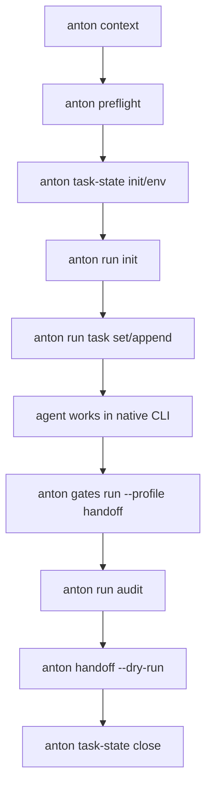

# Refactor: Anton Runner-Inspired Harness Consolidation

## Executive Summary

Anton should absorb the reusable parts of the PhysEdit repo harness and become the active, CLI-first harness substrate. PhysEdit should stop requiring `planning-with-files` as its repo harness contract, while the skill itself remains available for agents that explicitly want that workflow. The new steady state is:

- Anton owns durable task lifecycle, run checklist/audit state, preflight, handoff, migration/readiness checks, and reusable gate receipts.
- Repo entrypoints stay short and map-like.
- Repo-local harness code is either deleted, reduced to thin project policy adapters, or kept only for truly project-specific research policy.
- `planning-with-files` becomes optional/projection-only in adopter repos rather than a mandatory hard rule.
- Ideas from [kcosr/agent-runner](https://github.com/kcosr/agent-runner) are absorbed selectively: manifest-first run state, explicit lifecycle transitions, deterministic hooks, passive sidecar mode, and auditability. Anton should not become a backend runner, daemon, IDE, scheduler, or full orchestration platform.

This plan intentionally targets a large one-shot refactor. It should land as a single coherent feature branch or a tightly stacked series with one integration gate at the end.

## Source References

- Existing Anton roadmap: `docs/plans/2026-05-08-001-feat-anton-vnext-master-roadmap-plan.md`
- Native harness split plan: `docs/plans/2026-05-13-001-feat-anton-native-agent-harness-split-plan.md`
- Declarative gates plan: `docs/plans/2026-05-08-008-feat-anton-declarative-gates-surface-plan.md`
- Task/handoff slice plan: `docs/plans/2026-05-08-003-feat-anton-task-handoff-slice-plan.md`
- Anton product boundary: `README.md`, `CONTEXT.md`, `AGENTS.md`
- External reference: [agent-runner concepts](https://raw.githubusercontent.com/kcosr/agent-runner/main/docs/concepts.md)
- External reference: [agent-runner scope](https://raw.githubusercontent.com/kcosr/agent-runner/main/docs/scope.md)
- External reference: [agent-runner hooks](https://raw.githubusercontent.com/kcosr/agent-runner/main/docs/hooks.md)

## Current Diagnosis

Anton already has the right product boundary:

- CLI-first, repo-agnostic harness.
- Does not run coding agents.
- Does not own scheduling, UI, queueing, or budgets.
- Uses `anton.yaml` plus native contracts for task state, preflight, workspace checks, handoff, gates, and migration readiness.

The problem is that the adopter pressure has outrun the consolidated Anton surface:

- Some repos still carry heavy local harness scripts, hooks, and checkers.
- `planning-with-files` is still treated as a hard harness requirement in at least one high-pressure adopter even though current models often handle shorter, machine-checkable contracts better.
- Anton task state is already central, but it does not yet offer a simple "run manifest" surface for checklists, attempts, audit receipts, and planning projections.
- `gates run` is deliberately blocked, which was correct for the first Anton slice, but it leaves repos depending on local shell wrappers for validation receipts.
- Large Anton packages now contain enough behavior that the next change should split them along product concepts instead of continuing to grow monoliths.

The opportunity is to make Anton the place where known harness patterns are encoded once, while keeping project-specific policy out of Anton core.

## Borrow From Agent-Runner

Anton should borrow these ideas:

- **Manifest as source of truth.** Agent-runner uses a task/run manifest for state. Anton should add a native run manifest alongside task lifecycle state.
- **Passive sidecar mode.** Agent-runner can monitor externally driven work without replacing the backend. Anton should stay in this passive mode by default.
- **Lifecycle events.** Agent-runner has stable stages such as prepare, before attempt, after attempt, and transitions. Anton should expose equivalent concepts as receipts and command boundaries, not as always-on background behavior.
- **Auditable transitions.** State changes should be explicit CLI mutations with JSON output, not freehand markdown edits.
- **Scoped runner responsibility.** Agent-runner does not replace backend-native features. Anton should preserve that line even more strongly.

Anton should reject these ideas for now:

- Running agent backends directly.
- Long-lived daemon control.
- Scheduler or queue ownership.
- IDE/dashboard scope.
- Shell-hook systems that mutate repo state invisibly.
- Full parity with agent-runner's orchestration model.

## Requirements

### R1. Replace Mandatory Planning Files With Anton-Owned Run State

The active harness path must no longer require the `planning-with-files` skill or the `task_plan.md`, `findings.md`, and `progress.md` triad as the canonical state model. Anton should provide an equivalent or better machine-checkable state path.

Acceptance criteria:

- A task can be initialized, updated, audited, and handed off using Anton-native state without requiring planning-file triads.
- Existing repos that still use planning files continue to pass compatibility checks.
- Anton documentation clearly says planning files are optional projections or compatibility artifacts, not the preferred canonical surface.

### R2. Add A Native Run Manifest

Anton should add a small run manifest inspired by agent-runner's `run.json` concept. This manifest records checklist items, attempts, validation receipts, audit notes, and closure state.

Acceptance criteria:

- New `anton run` commands exist for initializing, inspecting, updating, auditing, and closing a run manifest.
- Run state is JSON-serializable and stable enough for downstream tooling.
- Run manifests are tied to Anton task identity and do not invent task identity implicitly.
- The manifest is passive: it records and validates work but does not run coding agents.

### R3. Keep Task Lifecycle And Run Execution State Separate

`task-state` remains the lifecycle owner. `run` owns execution checklist and receipts. Handoff consumes both.

Acceptance criteria:

- Task identity, status, environment, freshness, close/reopen, and card sync remain under `task-state`.
- Checklist, attempt, validation, and audit receipts live under `run`.
- Handoff output includes both lifecycle state and run audit state.

### R4. Consolidate Reusable Repo Harness Patterns Into Anton

Anton should absorb generic harness behavior currently repeated in adopter repos:

- Short startup/context command.
- Machine-checkable task state.
- Preflight readiness.
- Workspace/path reference audits.
- Handoff receipts.
- Gate metadata and safe command receipts.
- Adoption reports that classify local harness code as "move to Anton", "keep project-local", or "delete".

Acceptance criteria:

- Anton can produce an adopter harness inventory report.
- The report is repo-agnostic and driven by patterns/config, not hard-coded adopter names.
- The report distinguishes generic harness behavior from project-specific policy.

### R5. Enable A Safe Gates Runner Subset

The previous "declarative gates only" boundary was right for Slice 1. This refactor should introduce a safe, bounded runner for explicit command gates while preserving a conservative security model.

Acceptance criteria:

- `anton gates run` supports only argv-style commands declared in `anton.yaml`.
- No shell string execution is allowed.
- Command cwd must remain inside the repo root.
- Destructive gates require explicit metadata and are blocked by default.
- Timeouts, output caps, exit code capture, and receipts are enforced.
- Gate run receipts can be attached to the run manifest and handoff.

### R6. Preserve Anton's Product Boundary

This refactor must not turn Anton into a daemon, scheduler, queue, IDE, or coding-agent backend wrapper.

Acceptance criteria:

- Commands are user-invoked and deterministic.
- No background process is introduced.
- No backend-specific automation is introduced.
- README and CONTEXT keep the boundary explicit.

### R7. Support A PhysEdit-Style Migration Without Encoding PhysEdit In Core

PhysEdit is the pressure test, not the product definition. Anton should gain enough generic surface to let a follow-up adopter PR remove mandatory planning files and shrink local harness code.

Acceptance criteria:

- A migration guide explains how an adopter would move from planning-file triads and local Python harness scripts to Anton-native state.
- Fixtures model the shape of a heavy adopter harness without hard-coding the real adopter repo.
- No Anton package imports adopter-specific policy.

### R8. Make The Refactor Maintainable

Large Anton packages should be split where the new surfaces would otherwise make them harder to reason about.

Acceptance criteria:

- New run behavior lives in `internal/run`.
- Gate execution lives in focused gate runner files, not in the existing metadata-only parser.
- Task-state compatibility and mutation code are split enough that lifecycle, schema, rendering, and command parsing can be tested independently.
- Public command behavior remains stable.

## Non-Goals

- Delete the `planning-with-files` skill from the user's machine.
- Modify downstream adopter repos in this Anton PR.
- Encode adopter-specific branch names, task IDs, paths, or research policy in Anton core.
- Build a daemon, queue, UI, scheduler, or budget system.
- Run Codex, Claude, or any other coding-agent backend from Anton.
- Add MCP, memory, or slash-command replacement behavior.
- Make `gates run` execute arbitrary shell strings.
- Migrate every downstream local checker in one pass.

## Target User Flow



The key point is that the agent still works in its native CLI. Anton supplies the substrate around that work.

## Proposed Architecture

### Package Layout

New or changed packages:

- `internal/run`: native run manifest, command surface, checklist, attempts, audit receipts.
- `internal/gates`: safe runner for declared gates, receipt writing, execution policy.
- `internal/contract`: shared receipt types used by run, gates, handoff, and task state.
- `internal/taskstate`: split lifecycle mutation, compatibility parsing, projection rendering, and command parsing.
- `internal/adopt`: adopter harness inventory and migration report.
- `internal/handoff`: consume run manifest and gate receipts.
- `internal/app`: register `run` command and updated `gates run` behavior.

Existing concepts stay intact:

- `task-state` owns lifecycle.
- `gates list/check` stay metadata-only.
- `workspace` and `migrate` remain read/check surfaces.
- `handoff` remains the final transfer artifact.
- `preflight` stays cheap and explicit.

### Native Run Manifest

Suggested schema:

```json
{
  "schema_version": 1,
  "task_id": "0050_repo_topology_hard_cut",
  "created_at": "2026-05-20T00:00:00Z",
  "updated_at": "2026-05-20T00:00:00Z",
  "mode": "sidecar",
  "planning_mode": "run_manifest",
  "checklist": [
    {
      "id": "u1",
      "title": "Add run manifest command surface",
      "status": "pending",
      "notes": []
    }
  ],
  "attempts": [
    {
      "id": "attempt-001",
      "started_at": "2026-05-20T00:00:00Z",
      "ended_at": "2026-05-20T00:00:00Z",
      "summary": "Implemented run manifest surface",
      "receipts": []
    }
  ],
  "audit": [
    {
      "kind": "gate",
      "name": "tests",
      "status": "passed",
      "summary": "go test ./...",
      "receipt_path": ".anton/tasks/active/example/receipts/gates/tests.json"
    }
  ]
}
```

Schema notes:

- `mode` is `sidecar` for this release.
- `planning_mode` distinguishes `run_manifest`, `planning_files`, and `hybrid`.
- Checklist item statuses should stay small: `pending`, `in_progress`, `blocked`, `done`, `dropped`.
- Receipts should use shared contract structs so handoff can render them consistently.
- Manifest paths should be derived from task identity and adapter config.

### Config Additions

Add a small config surface:

```yaml
tasks:
  planning_mode: run_manifest

run:
  enabled: true
  manifest: run.json
  receipts_dir: receipts

gates:
  profiles:
    handoff:
      required: ["unit", "contracts"]
```

Compatibility rules:

- If `run.enabled` is missing, Anton preserves current behavior.
- If `tasks.planning_mode` is missing, Anton chooses the current compatible default.
- `planning_files` remains a supported mode.
- `hybrid` allows both run manifest and planning files, useful during adopter migration.

## Implementation Plan

### U1. Lock Product Boundary And Runner-Inspired Design

Files:

- `README.md`
- `CONTEXT.md`
- `docs/plans/2026-05-13-001-feat-anton-native-agent-harness-split-plan.md`
- `docs/plans/2026-05-20-001-refactor-anton-runner-harness-consolidation-plan.md`

Work:

- Update product docs to say Anton is gaining passive run-manifest support, not becoming an agent runner backend.
- Add an "inspired by agent-runner" note that borrows manifest/lifecycle/audit ideas while rejecting daemon/backend scope.
- Clarify that planning files are compatibility artifacts, not the preferred canonical model for new adopters.
- Keep the previous no-daemon/no-queue/no-UI boundary intact.

Validation:

- Manual doc read for contradictions against `AGENTS.md`.
- `rg -n "daemon|scheduler|queue|planning-with-files|task_plan.md|run manifest|agent-runner" README.md CONTEXT.md docs/plans`

### U2. Add `internal/run` And `anton run`

Files:

- `internal/run/manifest.go`
- `internal/run/store.go`
- `internal/run/command.go`
- `internal/run/render.go`
- `internal/run/run_test.go`
- `internal/run/testdata/`
- `internal/app/app.go`
- `internal/adapter/config.go`
- `internal/adapter/default.go`

Command surface:

- `anton run init --json`
- `anton run status --json`
- `anton run task list --json`
- `anton run task add --id <id> --title <title> --json`
- `anton run task set --id <id> --status <status> --note <note> --json`
- `anton run audit add --kind <kind> --name <name> --status <status> --summary <summary> --json`
- `anton run close --status <status> --summary <summary> --json`

Work:

- Resolve run location from existing task identity and adapter layout.
- Refuse to initialize without resolvable task identity unless a caller provides an explicit configured task directory.
- Implement atomic JSON writes.
- Add JSON output for all commands.
- Keep command names short but avoid introducing a top-level `task` alias that conflicts with `task-state`.
- Ensure all mutations are explicit and machine-readable.

Validation:

- `go test ./internal/run ./internal/adapter ./internal/app`
- Golden JSON tests for init/status/audit output.
- Negative tests for missing task identity and invalid checklist status.

### U3. Separate Task Lifecycle From Run Planning Mode

Files:

- `internal/taskstate/taskstate.go`
- `internal/taskstate/lifecycle.go`
- `internal/taskstate/compat.go`
- `internal/taskstate/projection.go`
- `internal/taskstate/taskstate_test.go`
- `internal/adapter/config.go`
- `internal/contract/contract.go`
- `README.md`

Work:

- Add `tasks.planning_mode` with supported values: `planning_files`, `run_manifest`, `hybrid`.
- Keep existing compatibility behavior when the field is absent.
- Teach task-state checks that run manifest can satisfy the durable-planning contract when configured.
- Keep lifecycle mutation in `task-state`; do not duplicate lifecycle status in `run`.
- Add projection helpers so adopters can export planning-file style summaries if they still need them.

Validation:

- Existing task-state tests pass unchanged where possible.
- New tests cover all planning modes.
- Regression test: legacy planning-file bundle still passes.
- Regression test: run-manifest-only bundle passes when configured.

### U4. Implement Safe `anton gates run`

Files:

- `internal/gates/runner.go`
- `internal/gates/runner_policy.go`
- `internal/gates/runner_receipt.go`
- `internal/gates/runner_test.go`
- `internal/gates/command.go`
- `internal/contract/contract.go`
- `internal/run/manifest.go`
- `internal/run/store.go`

Command surface:

- `anton gates run --gate <name> --json`
- `anton gates run --profile <profile> --json`
- `anton gates run --profile handoff --attach-run --json`
- `anton gates run --dry-run --json`

Safety policy:

- Execute argv arrays only.
- Never pass commands through a shell.
- Enforce repo-root-contained cwd.
- Enforce timeout and output-size cap.
- Record stdout/stderr summaries and receipt path.
- Block destructive gates unless an explicit future opt-in policy exists.
- Treat missing gates as configuration errors.
- Attach receipts to run manifest only when `--attach-run` is provided.

Validation:

- `go test ./internal/gates ./internal/run`
- Negative tests for shell strings, cwd escape, timeout, output cap, and destructive gates.
- Receipt golden tests for pass/fail/skipped/error outcomes.

### U5. Add Adopter Harness Inventory And Migration Report

Files:

- `internal/adopt/harness_inventory.go`
- `internal/adopt/harness_inventory_test.go`
- `internal/adopt/command.go`
- `internal/adopt/testdata/heavy-harness/`
- `internal/app/app.go`
- `README.md`

Command surface:

- `anton adopt harness-inventory --json`
- `anton adopt harness-inventory --format markdown`

Work:

- Inventory common harness surfaces: entrypoint docs, hook configs, local status scripts, local gate wrappers, local path/reference checkers, local handoff scripts, and planning-file requirements.
- Classify findings:
  - `move_to_anton`: generic behavior Anton should own.
  - `keep_project_local`: project-specific research or infra policy.
  - `delete_or_deprecate`: redundant or too cumbersome for current models.
  - `manual_review`: ambiguous.
- Do not hard-code adopter names.
- Add pattern rules as data where practical, not scattered if statements.

Validation:

- `go test ./internal/adopt`
- Fixture report includes all four classifications.
- Report includes stable JSON for downstream automation.

### U6. Add Migration Guide For Heavy Harness Adopters

Files:

- `docs/guides/harness-consolidation.md`
- `docs/guides/run-manifest.md`
- `docs/guides/gates-runner.md`
- `README.md`

Work:

- Explain the migration sequence:
  1. Add or update `anton.yaml`.
  2. Initialize task-state.
  3. Initialize run manifest.
  4. Move planning-file hard rules to optional projection mode.
  5. Replace local wrapper checks with declared gates.
  6. Use adopter inventory to decide what to delete, keep, or migrate later.
  7. Produce handoff from task-state plus run receipts.
- Include a section specifically for repos that previously required `planning-with-files`.
- Include a section on what not to migrate into Anton core.

Validation:

- `rg -n "planning-with-files|run manifest|gates run|project-specific|daemon|backend" docs/guides README.md`
- Manual doc review against product boundary.

### U7. Refactor Large Packages Along New Boundaries

Files:

- `internal/taskstate/taskstate.go`
- `internal/taskstate/lifecycle.go`
- `internal/taskstate/compat.go`
- `internal/taskstate/render.go`
- `internal/taskstate/projection.go`
- `internal/doctor/doctor.go`
- `internal/doctor/probes.go`
- `internal/adapter/default.go`
- `internal/adapter/schema.go`

Work:

- Split only where the new behavior would otherwise make existing large files harder to maintain.
- Preserve package-level APIs.
- Keep command output stable.
- Move schema/default rendering helpers into focused files.
- Avoid unrelated renames.

Validation:

- `go test ./...`
- `git diff --check`
- Snapshot/golden tests unchanged except where new fields are intentionally added.

### U8. Integrate Run, Gates, And Handoff Receipts

Files:

- `internal/handoff/handoff.go`
- `internal/handoff/handoff_test.go`
- `internal/contract/contract.go`
- `internal/run/manifest.go`
- `internal/run/render.go`
- `internal/gates/runner_receipt.go`

Work:

- Handoff reads run manifest when present.
- Handoff includes checklist summary, latest audit items, and gate receipts.
- Handoff degrades gracefully when a repo has only legacy planning files.
- Handoff output remains concise enough for agent continuation.

Validation:

- `go test ./internal/handoff ./internal/run ./internal/gates`
- Golden handoff tests for legacy, run-only, and hybrid modes.

### U9. End-To-End Fixture And Dogfood Script

Files:

- `internal/testdata/repos/heavy-harness/`
- `internal/testdata/repos/run-manifest-only/`
- `scripts/dogfood_harness_consolidation.sh`
- `docs/guides/harness-consolidation.md`

Work:

- Add a fixture that models a heavy local harness without embedding a real adopter repo.
- Add a fixture that models a clean Anton-native run-manifest-only repo.
- Add a dogfood script that runs the full intended loop on fixtures:
  - `anton context`
  - `anton preflight`
  - `anton task-state init`
  - `anton run init`
  - `anton run task add/set`
  - `anton gates check`
  - `anton gates run --dry-run`
  - `anton handoff --dry-run`
  - `anton adopt harness-inventory`

Validation:

- `bash scripts/dogfood_harness_consolidation.sh`
- `go test ./...`

## Migration Strategy For Heavy Adopters

This plan does not modify downstream repos directly. After Anton lands, a downstream adopter can migrate in this order:

1. Add `run.enabled: true` and `tasks.planning_mode: hybrid`.
2. Keep existing planning files temporarily.
3. Initialize native run manifests for active tasks.
4. Replace local validation wrapper output with `anton gates run` receipts.
5. Use `anton adopt harness-inventory` to classify local harness files.
6. Flip to `tasks.planning_mode: run_manifest`.
7. Remove mandatory `planning-with-files` language from repo entrypoints.
8. Delete local harness code only after Anton checks prove equivalent behavior.

This preserves a rollback path: if the run manifest path is not ready, the adopter can stay in `hybrid` mode.

## Validation Matrix

Core unit tests:

- `go test ./internal/run`
- `go test ./internal/gates`
- `go test ./internal/taskstate`
- `go test ./internal/handoff`
- `go test ./internal/adopt`
- `go test ./...`

Contract checks:

- `anton context --json`
- `anton preflight --json`
- `anton task-state init --json`
- `anton run init --json`
- `anton run status --json`
- `anton gates list --json`
- `anton gates check --json`
- `anton gates run --dry-run --json`
- `anton handoff --dry-run --json`
- `anton adopt harness-inventory --json`

Compatibility checks:

- Legacy planning-file fixture passes.
- Run-manifest-only fixture passes.
- Hybrid fixture passes.
- Missing task identity fails clearly.
- Unsafe gate config fails clearly.
- Handoff without run manifest still works.

Manual review:

- README and CONTEXT still say Anton is not a daemon or backend runner.
- No adopter-specific names or policies appear in core package logic.
- New commands are discoverable and small.

## Risk Register

### Risk 1. Anton Accidentally Becomes An Agent Runner

Mitigation:

- Keep all run behavior sidecar-only.
- Do not spawn Codex, Claude, or other backends.
- Put the boundary in README, CONTEXT, and command help.

### Risk 2. Config Surface Gets Too Large

Mitigation:

- Add only `tasks.planning_mode`, `run.enabled`, `run.manifest`, `run.receipts_dir`, and gate profiles.
- Avoid per-adopter knobs.
- Prefer conventions over configuration for manifest locations.

### Risk 3. Gates Runner Reintroduces Unsafe Shell Behavior

Mitigation:

- Require argv arrays.
- Forbid shell strings.
- Enforce repo-contained cwd.
- Add tests for malicious configs.
- Keep destructive gates blocked until a separate reviewed plan.

### Risk 4. Planning-File Users Break

Mitigation:

- Default missing config to current-compatible behavior.
- Add legacy fixture coverage.
- Make migration opt-in through `planning_mode`.

### Risk 5. One-Shot Refactor Becomes Too Big To Review

Mitigation:

- Keep units internally reviewable.
- Use separate commits by package/surface if possible.
- Preserve old command output until the integration point.
- Add fixtures before deleting or weakening old behavior.

### Risk 6. Adopter Inventory Becomes Too Opinionated

Mitigation:

- Report classifications as recommendations.
- Use `manual_review` for uncertain cases.
- Do not automatically delete files.
- Do not encode adopter-specific file paths in core logic.

## Done Criteria

The refactor is complete when:

- `anton run` exists and can manage run manifests.
- `task-state` supports planning modes without breaking legacy planning-file repos.
- `anton gates run` has a safe dry-run and execution subset with receipts.
- `handoff` consumes run and gate receipts.
- `adopt harness-inventory` classifies heavy harness surfaces.
- Docs explain how to migrate away from mandatory `planning-with-files`.
- Fixtures cover legacy, hybrid, and run-manifest-only flows.
- `go test ./...` passes.
- `bash scripts/dogfood_harness_consolidation.sh` passes.
- README and CONTEXT preserve Anton's no-daemon/no-backend-runner boundary.

## Recommended Commit Shape

If this lands as grouped commits, use this shape:

1. `docs: define runner-inspired harness consolidation boundary`
2. `feat(run): add native run manifest sidecar`
3. `refactor(task-state): separate planning modes and projections`
4. `feat(gates): add safe declared gate runner`
5. `feat(adopt): add harness inventory report`
6. `feat(handoff): include run and gate receipts`
7. `test: add harness consolidation fixtures and dogfood script`
8. `docs: add heavy-harness migration guide`

## Deferred Follow-Up

After Anton lands, create a separate downstream adopter plan to:

- Remove mandatory `planning-with-files` from repo entrypoints.
- Replace local task-state mutation scripts with Anton commands.
- Replace local validation wrappers with declared Anton gates.
- Delete redundant local harness code after inventory review.
- Keep only project-specific research and infra policy in the adopter repo.
